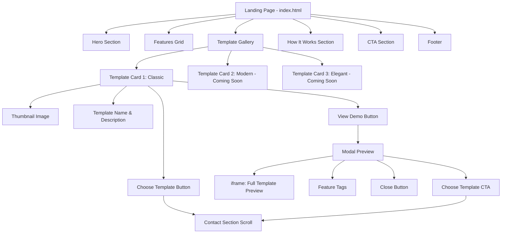
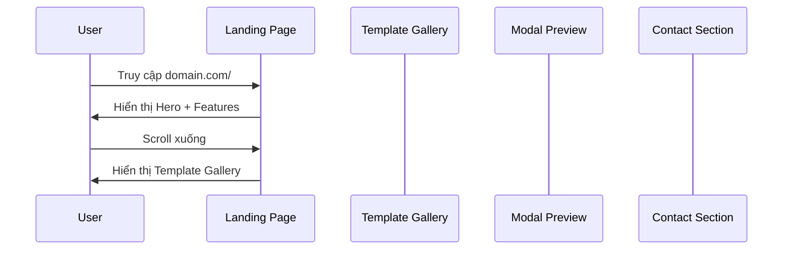

# Design Document: Landing Page với Template Selection

## Overview

Nâng cấp landing page hiện tại (`index.html`) để trở nên đẹp mắt, chuyên nghiệp hơn và thêm phần cho khách hàng xem preview các mẫu thiệp cưới có sẵn. Trang sẽ bao gồm hero section ấn tượng với gradient và typography đẹp, template gallery với preview tương tác (modal popup), phần "How It Works" giải thích quy trình, và CTA rõ ràng để khách hàng liên hệ. Thiết kế tập trung vào trải nghiệm người dùng mượt mà với animations tinh tế, responsive hoàn hảo trên mọi thiết bị, và tận dụng TailwindCSS để styling nhanh chóng.

## Architecture



## Main User Flow



    TG->>U: Hiển thị 3 mẫu thiệp (1 active, 2 coming soon)

    alt User clicks "Xem Demo"
        U->>TG: Click "Xem Demo" button
        TG->>M: Mở modal với iframe
        M->>U: Load wedding.html?slug=demo trong iframe
        U->>M: Xem preview tương tác
        U->>M: Click "Chọn mẫu này" hoặc Close
        M->>C: Scroll smooth đến Contact Section
    else User clicks "Chọn mẫu này"
        U->>TG: Click "Chọn mẫu này" button
        TG->>C: Scroll smooth đến Contact Section
    end

    C->>U: Hiển thị form liên hệ (email/phone)
    U->>C: Click contact button
    C->>U: Mở email client hoặc phone dialer

````

## Components and Interfaces

### Component 1: Hero Section

**Purpose**: Tạo ấn tượng đầu tiên mạnh mẽ, truyền tải giá trị cốt lõi của dịch vụ

**HTML Structure**:
```html
<section id="hero" class="relative min-h-screen flex items-center justify-center overflow-hidden">
  <div class="absolute inset-0 bg-gradient-to-br from-cream-50 via-rose-pastel-100/30 to-cream-100"></div>
  <div class="relative z-10 container mx-auto px-4 text-center">
    <h1 class="font-playfair text-6xl md:text-7xl lg:text-8xl font-bold mb-6">
      <span class="gradient-text">Thiệp Cưới Online</span>
    </h1>
    <p class="font-cormorant text-3xl md:text-4xl text-rose-pastel-300 italic mb-8">
      Tạo kỷ niệm đẹp cho ngày trọng đại
    </p>
    <p class="text-gray-600 text-lg md:text-xl max-w-3xl mx-auto mb-12">
      Thiết kế thiệp cưới online sang trọng, hiện đại với đầy đủ tính năng:
      Gallery ảnh, Bản đồ, QR mừng cưới, Quản lý khách mời
    </p>
    <button onclick="scrollToTemplates()" class="cta-button">
      Xem Mẫu Thiệp <i class="fas fa-arrow-down ml-2"></i>
    </button>
  </div>
</section>
````

**Responsibilities**:

- Hiển thị tiêu đề chính với gradient text effect
- Tagline và mô tả ngắn gọn về dịch vụ
- CTA button scroll xuống Template Gallery
- Background gradient với animation tinh tế

### Component 2: Features Grid

**Purpose**: Highlight các tính năng nổi bật của dịch vụ

**HTML Structure**:

```html
<section id="features" class="py-20 bg-white">
  <div class="container mx-auto px-4">
    <h2 class="section-title">Tính Năng Nổi Bật</h2>
    <div class="grid md:grid-cols-2 lg:grid-cols-4 gap-8">
      <!-- Feature Card -->
      <div class="feature-card">
        <div class="icon-wrapper">
          <i class="fas fa-mobile-alt"></i>
        </div>
        <h3>Responsive Design</h3>
        <p>Hiển thị hoàn hảo trên mọi thiết bị</p>
      </div>
      <!-- Repeat for other features -->
    </div>
  </div>
</section>
```

**Responsibilities**:

- Grid layout responsive (1 col mobile, 2 cols tablet, 4 cols desktop)
- Icon + Title + Description cho mỗi feature
- Hover effects với scale và shadow

### Component 3: Template Gallery

**Purpose**: Hiển thị các mẫu thiệp cưới có sẵn với preview và CTA

**HTML Structure**:

```html
<section
  id="templates"
  class="py-20 bg-gradient-to-br from-cream-50 to-cream-100"
>
  <div class="container mx-auto px-4">
    <h2 class="section-title">Mẫu Thiệp Cưới</h2>
    <p class="section-subtitle">
      Chọn mẫu thiệp phù hợp với phong cách của bạn
    </p>

    <div class="grid md:grid-cols-2 lg:grid-cols-3 gap-8 mt-12">
      <!-- Template Card - Active -->
      <div class="template-card active">
        <div class="template-thumbnail">
          
          <div class="template-overlay">
            <button onclick="openPreview('classic')" class="btn-preview">
              <i class="fas fa-eye"></i> Xem Demo
            </button>
          </div>
        </div>
        <div class="template-info">
          <h3>Classic Elegance</h3>
          <p>Thiết kế sang trọng, cổ điển với màu pastel nhẹ nhàng</p>
          <div class="template-features">
            <span class="feature-tag"
              ><i class="fas fa-images"></i> Gallery</span
            >
            <span class="feature-tag"
              ><i class="fas fa-map-marker-alt"></i> Bản đồ</span
            >
            <span class="feature-tag"
              ><i class="fas fa-qrcode"></i> QR Code</span
            >
          </div>
          <button onclick="scrollToContact('classic')" class="btn-choose">
            Chọn mẫu này
          </button>
        </div>
      </div>

      <!-- Template Card - Coming Soon -->
      <div class="template-card coming-soon">
        <div class="template-thumbnail">
          
          <div class="coming-soon-badge">Sắp ra mắt</div>
        </div>
        <div class="template-info">
          <h3>Modern Minimalist</h3>
          <p>Phong cách tối giản, hiện đại cho cặp đôi trẻ trung</p>
        </div>
      </div>

      <!-- Template Card - Coming Soon -->
      <div class="template-card coming-soon">
        <div class="template-thumbnail">
          
          <div class="coming-soon-badge">Sắp ra mắt</div>
        </div>
        <div class="template-info">
          <h3>Royal Elegance</h3>
          <p>Thiết kế hoàng gia, lộng lẫy cho đám cưới sang trọng</p>
        </div>
      </div>
    </div>
  </div>
</section>
```

**Responsibilities**:

- Grid layout responsive cho template cards
- Hiển thị thumbnail với overlay hover effect
- "Xem Demo" button mở modal preview
- "Chọn mẫu này" button scroll đến contact section
- Coming soon badge cho templates chưa có
- Feature tags hiển thị tính năng của template

### Component 4: Modal Preview

**Purpose**: Hiển thị full preview của template trong modal với iframe

**HTML Structure**:

```html
<div id="previewModal" class="modal hidden">
  <div class="modal-backdrop" onclick="closePreview()"></div>
  <div class="modal-content">
    <button class="modal-close" onclick="closePreview()">
      <i class="fas fa-times"></i>
    </button>
    <div class="modal-header">
      <h3 id="modalTitle">Classic Elegance</h3>
      <div class="modal-features">
        <span class="feature-tag"><i class="fas fa-images"></i> Gallery</span>
        <span class="feature-tag"
          ><i class="fas fa-map-marker-alt"></i> Bản đồ</span
        >
        <span class="feature-tag"><i class="fas fa-qrcode"></i> QR Code</span>
      </div>
    </div>
    <div class="modal-body">
      <iframe id="previewFrame" src="" class="preview-iframe"></iframe>
    </div>
    <div class="modal-footer">
      <button onclick="closePreview()" class="btn-secondary">Đóng</button>
      <button onclick="chooseFromModal()" class="btn-primary">
        Chọn mẫu này
      </button>
    </div>
  </div>
</div>
```

**JavaScript Interface**:

```javascript
// Modal control functions
function openPreview(templateId) {
  const modal = document.getElementById("previewModal");
  const iframe = document.getElementById("previewFrame");
  const title = document.getElementById("modalTitle");

  // Set template data
  const templates = {
    classic: {
      title: "Classic Elegance",
      url: "/wedding.html?slug=demo",
    },
  };

  const template = templates[templateId];
  title.textContent = template.title;
  iframe.src = template.url;

  // Show modal with animation
  modal.classList.remove("hidden");
  document.body.style.overflow = "hidden";
}

function closePreview() {
  const modal = document.getElementById("previewModal");
  const iframe = document.getElementById("previewFrame");

  modal.classList.add("hidden");
  iframe.src = "";
  document.body.style.overflow = "auto";
}

function chooseFromModal() {
  closePreview();
  scrollToContact();
}
```

**Responsibilities**:

- Hiển thị modal fullscreen với backdrop
- Load template preview trong iframe
- Close button và backdrop click để đóng
- CTA button "Chọn mẫu này" scroll đến contact
- Prevent body scroll khi modal mở

### Component 5: How It Works Section

**Purpose**: Giải thích quy trình sử dụng dịch vụ theo 3-4 bước đơn giản

**HTML Structure**:

```html
<section id="how-it-works" class="py-20 bg-white">
  <div class="container mx-auto px-4">
    <h2 class="section-title">Quy Trình Đơn Giản</h2>
    <p class="section-subtitle">Chỉ 3 bước để có thiệp cưới online hoàn hảo</p>

    <div class="steps-container">
      <!-- Step 1 -->
      <div class="step-card">
        <div class="step-number">1</div>
        <div class="step-icon">
          <i class="fas fa-palette"></i>
        </div>
        <h3>Chọn mẫu thiệp</h3>
        <p>Xem demo và chọn mẫu thiệp phù hợp với phong cách của bạn</p>
      </div>

      <!-- Step 2 -->
      <div class="step-card">
        <div class="step-number">2</div>
        <div class="step-icon">
          <i class="fas fa-comments"></i>
        </div>
        <h3>Liên hệ tư vấn</h3>
        <p>Gửi thông tin và yêu cầu của bạn qua email hoặc điện thoại</p>
      </div>

      <!-- Step 3 -->
      <div class="step-card">
        <div class="step-number">3</div>
        <div class="step-icon">
          <i class="fas fa-rocket"></i>
        </div>
        <h3>Nhận thiệp & Chia sẻ</h3>
        <p>Nhận link thiệp cưới và bắt đầu gửi đến khách mời</p>
      </div>
    </div>
  </div>
</section>
```

**Responsibilities**:

- Hiển thị 3 bước theo timeline horizontal (desktop) hoặc vertical (mobile)
- Step number badge với gradient
- Icon + Title + Description cho mỗi bước
- Connecting line giữa các bước (optional)

### Component 6: CTA Section (Contact)

**Purpose**: Kêu gọi hành động và cung cấp thông tin liên hệ

**HTML Structure**:

```html
<section
  id="contact"
  class="py-20 bg-gradient-to-br from-rose-pastel-100/30 to-cream-100"
>
  <div class="container mx-auto px-4 text-center">
    <h2 class="section-title">Sẵn sàng tạo thiệp cưới của bạn?</h2>
    <p class="section-subtitle">
      Liên hệ với chúng tôi để được tư vấn và báo giá miễn phí
    </p>

    <div class="flex flex-col sm:flex-row gap-6 justify-center mt-12">
      <a href="mailto:contact@example.com" class="cta-button primary">
        <i class="fas fa-envelope mr-2"></i>
        Liên hệ qua Email
      </a>
      <a href="tel:+84123456789" class="cta-button secondary">
        <i class="fas fa-phone mr-2"></i>
        Gọi điện thoại
      </a>
    </div>

    <div class="mt-12 text-gray-600">
      <p class="mb-2">
        <i class="fas fa-envelope mr-2"></i>
        Email: contact@example.com
      </p>
      <p>
        <i class="fas fa-phone mr-2"></i>
        Hotline: 0123 456 789
      </p>
    </div>
  </div>
</section>
```

**Responsibilities**:

- Hiển thị CTA buttons với email và phone links
- Thông tin liên hệ rõ ràng
- Smooth scroll target từ template selection

## Data Models

### Template Data Model

```javascript
interface Template {
  id: string;              // 'classic', 'modern', 'elegant'
  name: string;            // 'Classic Elegance'
  description: string;     // Short description
  thumbnail: string;       // Path to thumbnail image
  previewUrl: string;      // URL for iframe preview
  features: string[];      // ['gallery', 'map', 'qrcode', 'rsvp']
  status: 'active' | 'coming-soon';
  category?: string;       // 'traditional', 'modern', 'luxury'
}

// Example data
const templates = [
  {
    id: 'classic',
    name: 'Classic Elegance',
    description: 'Thiết kế sang trọng, cổ điển với màu pastel nhẹ nhàng',
    thumbnail: 'assets/images/ZIN_3506.jpg',
    previewUrl: '/wedding.html?slug=demo',
    features: ['gallery', 'map', 'qrcode', 'rsvp'],
    status: 'active',
    category: 'traditional'
  },
  {
    id: 'modern',
    name: 'Modern Minimalist',
    description: 'Phong cách tối giản, hiện đại cho cặp đôi trẻ trung',
    thumbnail: 'assets/images/template-modern-placeholder.jpg',
    previewUrl: null,
    features: ['gallery', 'map', 'qrcode'],
    status: 'coming-soon',
    category: 'modern'
  },
  {
    id: 'elegant',
    name: 'Royal Elegance',
    description: 'Thiết kế hoàng gia, lộng lẫy cho đám cưới sang trọng',
    thumbnail: 'assets/images/template-elegant-placeholder.jpg',
    previewUrl: null,
    features: ['gallery', 'map', 'qrcode', 'rsvp', 'countdown'],
    status: 'coming-soon',
    category: 'luxury'
  }
];
```

**Validation Rules**:

- `id` must be unique and kebab-case
- `status` must be either 'active' or 'coming-soon'
- `previewUrl` required if status is 'active'
- `features` array must contain at least one feature
- `thumbnail` path must be valid

## Key Functions with Formal Specifications

### Function 1: scrollToTemplates()

```javascript
function scrollToTemplates() {
  const templatesSection = document.getElementById("templates");
  templatesSection.scrollIntoView({ behavior: "smooth", block: "start" });
}
```

**Preconditions:**

- Element with id 'templates' exists in DOM
- Browser supports smooth scrolling

**Postconditions:**

- Page scrolls to templates section smoothly
- Templates section is visible at top of viewport
- No side effects on other page elements

### Function 2: openPreview(templateId)

```javascript
function openPreview(templateId) {
  const modal = document.getElementById("previewModal");
  const iframe = document.getElementById("previewFrame");
  const title = document.getElementById("modalTitle");

  // Find template data
  const template = templates.find((t) => t.id === templateId);
  if (!template || template.status !== "active") {
    console.error("Template not available for preview");
    return;
  }

  // Update modal content
  title.textContent = template.name;
  iframe.src = template.previewUrl;

  // Show modal
  modal.classList.remove("hidden");
  modal.classList.add("flex");
  document.body.style.overflow = "hidden";
}
```

**Preconditions:**

- `templateId` is a valid string
- Modal elements exist in DOM
- Template with given id exists in templates array
- Template status is 'active'

**Postconditions:**

- Modal is visible with correct template data
- Iframe loads template preview URL
- Body scroll is disabled
- If template not found or inactive, function returns early with error log

### Function 3: closePreview()

```javascript
function closePreview() {
  const modal = document.getElementById("previewModal");
  const iframe = document.getElementById("previewFrame");

  // Hide modal
  modal.classList.add("hidden");
  modal.classList.remove("flex");

  // Clear iframe
  iframe.src = "";

  // Re-enable body scroll
  document.body.style.overflow = "auto";
}
```

**Preconditions:**

- Modal and iframe elements exist in DOM
- Modal is currently visible

**Postconditions:**

- Modal is hidden
- Iframe src is cleared (stops loading)
- Body scroll is re-enabled
- No memory leaks from iframe content

### Function 4: scrollToContact(templateId)

```javascript
function scrollToContact(templateId) {
  // Optional: Store selected template in sessionStorage
  if (templateId) {
    sessionStorage.setItem("selectedTemplate", templateId);
  }

  // Scroll to contact section
  const contactSection = document.getElementById("contact");
  contactSection.scrollIntoView({ behavior: "smooth", block: "start" });

  // Optional: Highlight contact section briefly
  contactSection.classList.add("highlight-pulse");
  setTimeout(() => {
    contactSection.classList.remove("highlight-pulse");
  }, 2000);
}
```

**Preconditions:**

- Element with id 'contact' exists in DOM
- `templateId` is optional string parameter
- Browser supports sessionStorage and smooth scrolling

**Postconditions:**

- Page scrolls to contact section smoothly
- If templateId provided, it's stored in sessionStorage
- Contact section briefly highlighted (2 seconds)
- Highlight animation removed after timeout

### Function 5: renderTemplateCards()

```javascript
function renderTemplateCards() {
  const container = document.getElementById("templatesGrid");

  templates.forEach((template) => {
    const card = createTemplateCard(template);
    container.appendChild(card);
  });
}

function createTemplateCard(template) {
  const card = document.createElement("div");
  card.className = `template-card ${template.status}`;

  // Build card HTML
  card.innerHTML = `
    <div class="template-thumbnail">
      
      ${
        template.status === "coming-soon"
          ? '<div class="coming-soon-badge">Sắp ra mắt</div>'
          : `<div class="template-overlay">
             <button onclick="openPreview('${template.id}')" class="btn-preview">
               <i class="fas fa-eye"></i> Xem Demo
             </button>
           </div>`
      }
    </div>
    <div class="template-info">
      <h3>${template.name}</h3>
      <p>${template.description}</p>
      ${
        template.status === "active"
          ? `<div class="template-features">
             ${template.features.map((f) => `<span class="feature-tag">${getFeatureIcon(f)} ${getFeatureLabel(f)}</span>`).join("")}
           </div>
           <button onclick="scrollToContact('${template.id}')" class="btn-choose">
             Chọn mẫu này
           </button>`
          : ""
      }
    </div>
  `;

  return card;
}
```

**Preconditions:**

- `templates` array is defined and populated
- Container element with id 'templatesGrid' exists
- Helper functions `getFeatureIcon()` and `getFeatureLabel()` are defined

**Postconditions:**

- All template cards are rendered in grid container
- Active templates have preview and choose buttons
- Coming soon templates have badge only
- Each card has proper event handlers attached

## Algorithmic Pseudocode

### Main Page Initialization Algorithm

```javascript
// Page initialization on DOMContentLoaded
document.addEventListener("DOMContentLoaded", function () {
  initializePage();
});

function initializePage() {
  // Step 1: Render template cards dynamically
  renderTemplateCards();

  // Step 2: Setup modal event listeners
  setupModalListeners();

  // Step 3: Setup smooth scroll for navigation
  setupSmoothScroll();

  // Step 4: Add intersection observer for animations
  setupScrollAnimations();

  // Step 5: Check if redirected from template selection
  checkSelectedTemplate();
}
```

**Preconditions:**

- DOM is fully loaded
- All required elements exist in HTML
- Templates data is defined
- CSS classes are properly defined

**Postconditions:**

- All template cards are rendered
- Event listeners are attached
- Scroll animations are initialized
- Page is ready for user interaction

### Modal Management Algorithm

```javascript
function setupModalListeners() {
  const modal = document.getElementById("previewModal");
  const backdrop = modal.querySelector(".modal-backdrop");
  const closeBtn = modal.querySelector(".modal-close");

  // Close on backdrop click
  backdrop.addEventListener("click", closePreview);

  // Close on close button click
  closeBtn.addEventListener("click", closePreview);

  // Close on ESC key
  document.addEventListener("keydown", function (e) {
    if (e.key === "Escape" && !modal.classList.contains("hidden")) {
      closePreview();
    }
  });
}
```

**Preconditions:**

- Modal element exists with proper structure
- Backdrop and close button elements exist
- Event listeners not already attached (prevent duplicates)

**Postconditions:**

- Modal can be closed via backdrop click
- Modal can be closed via close button
- Modal can be closed via ESC key
- No duplicate event listeners

**Loop Invariants:** N/A (no loops in this function)

### Smooth Scroll Animation Algorithm

```javascript
function setupSmoothScroll() {
  // Get all anchor links
  const anchorLinks = document.querySelectorAll('a[href^="#"]');

  anchorLinks.forEach((link) => {
    link.addEventListener("click", function (e) {
      e.preventDefault();

      const targetId = this.getAttribute("href").substring(1);
      const targetElement = document.getElementById(targetId);

      if (targetElement) {
        targetElement.scrollIntoView({
          behavior: "smooth",
          block: "start",
        });
      }
    });
  });
}
```

**Preconditions:**

- Anchor links with href starting with '#' exist
- Target elements with matching ids exist
- Browser supports smooth scrolling

**Postconditions:**

- All anchor links have click handlers
- Clicking anchor link scrolls smoothly to target
- Default link behavior is prevented
- If target not found, no scroll occurs

**Loop Invariants:**

- All previously processed links have event listeners attached
- No duplicate listeners on any link

### Scroll Animation with Intersection Observer

```javascript
function setupScrollAnimations() {
  const observerOptions = {
    threshold: 0.1,
    rootMargin: "0px 0px -100px 0px",
  };

  const observer = new IntersectionObserver(function (entries) {
    entries.forEach((entry) => {
      if (entry.isIntersecting) {
        entry.target.classList.add("animate-in");
        observer.unobserve(entry.target);
      }
    });
  }, observerOptions);

  // Observe all animatable elements
  const animatableElements = document.querySelectorAll(
    ".feature-card, .template-card, .step-card",
  );

  animatableElements.forEach((el) => {
    observer.observe(el);
  });
}
```

**Preconditions:**

- Browser supports IntersectionObserver API
- Elements with classes '.feature-card', '.template-card', '.step-card' exist
- CSS animation classes are defined

**Postconditions:**

- IntersectionObserver is created and configured
- All animatable elements are being observed
- Elements animate in when they enter viewport
- Observer stops observing after animation triggers (performance optimization)

**Loop Invariants:**

- All previously processed elements are being observed
- No element is observed more than once

## TailwindCSS Styling Guidelines

### Color Palette (Extended from existing)

```javascript
// Tailwind config extension
tailwind.config = {
  theme: {
    extend: {
      colors: {
        cream: {
          50: "#fffbf7",
          100: "#fff5f0",
          200: "#ffe8e0",
        },
        "rose-pastel": {
          100: "#f5d5d8",
          200: "#e8b4b8",
          300: "#d4a5a5",
        },
      },
      animation: {
        "fade-in": "fadeIn 0.6s ease-out",
        "slide-up": "slideUp 0.6s ease-out",
        "scale-in": "scaleIn 0.4s ease-out",
      },
      keyframes: {
        fadeIn: {
          "0%": { opacity: "0" },
          "100%": { opacity: "1" },
        },
        slideUp: {
          "0%": { transform: "translateY(30px)", opacity: "0" },
          "100%": { transform: "translateY(0)", opacity: "1" },
        },
        scaleIn: {
          "0%": { transform: "scale(0.95)", opacity: "0" },
          "100%": { transform: "scale(1)", opacity: "1" },
        },
      },
    },
  },
};
```

### Component CSS Classes

```css
/* Hero Section */
.gradient-text {
  background: linear-gradient(135deg, #d4a5a5 0%, #e8b4b8 100%);
  -webkit-background-clip: text;
  -webkit-text-fill-color: transparent;
  background-clip: text;
}

/* Section Titles */
.section-title {
  @apply font-playfair text-4xl md:text-5xl font-bold text-gray-800 text-center mb-4;
}

.section-subtitle {
  @apply font-cormorant text-xl md:text-2xl text-gray-600 text-center italic;
}

/* CTA Buttons */
.cta-button {
  @apply px-8 py-4 rounded-full font-semibold text-lg transition-all duration-300 
         shadow-lg hover:shadow-xl transform hover:-translate-y-1;
}

.cta-button.primary {
  @apply bg-rose-pastel-300 hover:bg-rose-pastel-200 text-white;
}

.cta-button.secondary {
  @apply bg-white hover:bg-gray-50 text-gray-800 border-2 border-gray-200;
}

/* Feature Cards */
.feature-card {
  @apply bg-white rounded-2xl p-8 shadow-md hover:shadow-xl 
         transition-all duration-300 transform hover:-translate-y-2;
}

.icon-wrapper {
  @apply w-16 h-16 bg-rose-pastel-100 rounded-full flex items-center 
         justify-center mx-auto mb-4;
}

.icon-wrapper i {
  @apply text-rose-pastel-300 text-2xl;
}

/* Template Cards */
.template-card {
  @apply bg-white rounded-3xl overflow-hidden shadow-lg hover:shadow-2xl 
         transition-all duration-300 transform hover:-translate-y-2;
}

.template-card.coming-soon {
  @apply opacity-75;
}

.template-thumbnail {
  @apply relative aspect-[3/4] overflow-hidden;
}

.template-thumbnail img {
  @apply w-full h-full object-cover;
}

.template-overlay {
  @apply absolute inset-0 bg-black/60 flex items-center justify-center 
         opacity-0 hover:opacity-100 transition-opacity duration-300;
}

.btn-preview {
  @apply px-6 py-3 bg-white text-gray-800 rounded-full font-semibold 
         hover:bg-rose-pastel-100 transition-colors;
}

.coming-soon-badge {
  @apply absolute top-4 right-4 px-4 py-2 bg-gray-800 text-white 
         rounded-full text-sm font-semibold;
}

.template-info {
  @apply p-6;
}

.template-features {
  @apply flex flex-wrap gap-2 my-4;
}

.feature-tag {
  @apply px-3 py-1 bg-rose-pastel-100 text-rose-pastel-300 rounded-full 
         text-sm font-medium;
}

.btn-choose {
  @apply w-full px-6 py-3 bg-rose-pastel-300 hover:bg-rose-pastel-200 
         text-white rounded-full font-semibold transition-colors;
}

/* Modal */
.modal {
  @apply fixed inset-0 z-50 items-center justify-center p-4;
}

.modal.hidden {
  @apply hidden;
}

.modal-backdrop {
  @apply absolute inset-0 bg-black/70 backdrop-blur-sm;
}

.modal-content {
  @apply relative bg-white rounded-3xl max-w-6xl w-full max-h-[90vh] 
         overflow-hidden shadow-2xl z-10 flex flex-col;
}

.modal-close {
  @apply absolute top-4 right-4 z-20 w-10 h-10 bg-white rounded-full 
         flex items-center justify-center shadow-lg hover:bg-gray-100 
         transition-colors;
}

.modal-header {
  @apply p-6 border-b border-gray-200;
}

.modal-body {
  @apply flex-1 overflow-hidden;
}

.preview-iframe {
  @apply w-full h-full border-0;
  min-height: 600px;
}

.modal-footer {
  @apply p-6 border-t border-gray-200 flex gap-4 justify-end;
}

/* Step Cards */
.steps-container {
  @apply grid md:grid-cols-3 gap-8 mt-12 relative;
}

.step-card {
  @apply relative bg-white rounded-2xl p-8 shadow-md hover:shadow-xl 
         transition-all duration-300 text-center;
}

.step-number {
  @apply absolute -top-4 left-1/2 transform -translate-x-1/2 
         w-12 h-12 bg-gradient-to-br from-rose-pastel-200 to-rose-pastel-300 
         text-white rounded-full flex items-center justify-center 
         font-bold text-xl shadow-lg;
}

.step-icon {
  @apply w-16 h-16 bg-rose-pastel-100 rounded-full flex items-center 
         justify-center mx-auto mb-4 mt-4;
}

.step-icon i {
  @apply text-rose-pastel-300 text-2xl;
}

/* Animations */
.animate-in {
  animation: slideUp 0.6s ease-out;
}

.highlight-pulse {
  animation: pulse 2s ease-in-out;
}

@keyframes pulse {
  0%,
  100% {
    background-color: transparent;
  }
  50% {
    background-color: rgba(245, 213, 216, 0.3);
  }
}
```

## Example Usage

### Complete HTML Structure Example

```html
<!doctype html>
<html lang="vi">
  <head>
    <meta charset="UTF-8" />
    <meta name="viewport" content="width=device-width, initial-scale=1.0" />
    <title>Thiệp Cưới Online - Tạo Thiệp Cưới Đẹp & Miễn Phí</title>
    <script src="https://cdn.tailwindcss.com"></script>
    <link
      rel="stylesheet"
      href="https://cdnjs.cloudflare.com/ajax/libs/font-awesome/6.4.0/css/all.min.css"
    />
    <link
      href="https://fonts.googleapis.com/css2?family=Playfair+Display:wght@400;600;700&family=Great+Vibes&family=Inter:wght@300;400;500;600&family=Cormorant+Garamond:ital,wght@0,400;0,600;1,400&display=swap"
      rel="stylesheet"
    />
    <script>
      tailwind.config = {
        theme: {
          extend: {
            fontFamily: {
              playfair: ["Playfair Display", "serif"],
              vibes: ["Great Vibes", "cursive"],
              cormorant: ["Cormorant Garamond", "serif"],
              inter: ["Inter", "sans-serif"],
            },
            colors: {
              cream: { 50: "#fffbf7", 100: "#fff5f0", 200: "#ffe8e0" },
              "rose-pastel": { 100: "#f5d5d8", 200: "#e8b4b8", 300: "#d4a5a5" },
            },
          },
        },
      };
    </script>
    <link rel="stylesheet" href="landing-styles.css" />
  </head>
  <body class="bg-gradient-to-br from-cream-50 via-cream-100 to-cream-50">
    <!-- Hero Section -->
    <section id="hero">...</section>

    <!-- Features Section -->
    <section id="features">...</section>

    <!-- Templates Section -->
    <section id="templates">...</section>

    <!-- How It Works Section -->
    <section id="how-it-works">...</section>

    <!-- Contact Section -->
    <section id="contact">...</section>

    <!-- Footer -->
    <footer>...</footer>

    <!-- Preview Modal -->
    <div id="previewModal" class="modal hidden">...</div>

    <script src="landing-script.js"></script>
  </body>
</html>
```

### JavaScript Usage Example

```javascript
// landing-script.js

// Template data
const templates = [
  {
    id: "classic",
    name: "Classic Elegance",
    description: "Thiết kế sang trọng, cổ điển với màu pastel nhẹ nhàng",
    thumbnail: "assets/images/ZIN_3506.jpg",
    previewUrl: "/wedding.html?slug=demo",
    features: ["gallery", "map", "qrcode", "rsvp"],
    status: "active",
  },
  // ... more templates
];

// Initialize on page load
document.addEventListener("DOMContentLoaded", function () {
  initializePage();
});

function initializePage() {
  renderTemplateCards();
  setupModalListeners();
  setupSmoothScroll();
  setupScrollAnimations();
}

// User clicks "Xem Demo" button
// <button onclick="openPreview('classic')">Xem Demo</button>
function openPreview(templateId) {
  const template = templates.find((t) => t.id === templateId);
  if (!template || template.status !== "active") return;

  const modal = document.getElementById("previewModal");
  const iframe = document.getElementById("previewFrame");

  iframe.src = template.previewUrl;
  modal.classList.remove("hidden");
  modal.classList.add("flex");
  document.body.style.overflow = "hidden";
}

// User clicks "Chọn mẫu này" button
// <button onclick="scrollToContact('classic')">Chọn mẫu này</button>
function scrollToContact(templateId) {
  if (templateId) {
    sessionStorage.setItem("selectedTemplate", templateId);
  }

  const contactSection = document.getElementById("contact");
  contactSection.scrollIntoView({ behavior: "smooth", block: "start" });
}
```

## Correctness Properties

### Property 1: Modal State Consistency

**Universal Quantification:**

```
∀ modal_state ∈ {open, closed}:
  (modal_state = open) ⟹ (body.overflow = 'hidden' ∧ iframe.src ≠ '')
  ∧
  (modal_state = closed) ⟹ (body.overflow = 'auto' ∧ iframe.src = '')
```

**Description:** Modal state must be consistent with body scroll and iframe content. When modal is open, body scroll is disabled and iframe has content. When closed, body scroll is enabled and iframe is cleared.

### Property 2: Template Card Rendering

**Universal Quantification:**

```
∀ template ∈ templates:
  (template.status = 'active') ⟹ (hasPreviewButton(template) ∧ hasChooseButton(template))
  ∧
  (template.status = 'coming-soon') ⟹ (hasComingSoonBadge(template) ∧ ¬hasPreviewButton(template))
```

**Description:** Active templates must have preview and choose buttons. Coming soon templates must have badge and no interactive buttons.

### Property 3: Smooth Scroll Behavior

**Universal Quantification:**

```
∀ anchor_link ∈ document.querySelectorAll('a[href^="#"]'):
  ∃ target_element ∈ DOM:
    (anchor_link.href.includes(target_element.id)) ⟹
    (click(anchor_link) → smoothScrollTo(target_element))
```

**Description:** Every anchor link with hash href must have a corresponding target element, and clicking it must trigger smooth scroll to that element.

### Property 4: Template Selection Persistence

**Universal Quantification:**

```
∀ templateId ∈ {valid template ids}:
  scrollToContact(templateId) ⟹
  (sessionStorage.getItem('selectedTemplate') = templateId)
```

**Description:** When user selects a template, the selection must be persisted in sessionStorage for potential use in contact form or future pages.

### Property 5: Responsive Layout Integrity

**Universal Quantification:**

```
∀ viewport_width ∈ [320px, ∞):
  (viewport_width < 768px) ⟹ (grid_columns = 1)
  ∧
  (768px ≤ viewport_width < 1024px) ⟹ (grid_columns = 2)
  ∧
  (viewport_width ≥ 1024px) ⟹ (grid_columns = 3)
```

**Description:** Template grid must adapt to viewport width with proper column counts for mobile, tablet, and desktop views.

## Error Handling

### Error Scenario 1: Template Not Found

**Condition:** User attempts to preview a template that doesn't exist or is not active

**Response:**

```javascript
function openPreview(templateId) {
  const template = templates.find((t) => t.id === templateId);

  if (!template) {
    console.error(`Template with id "${templateId}" not found`);
    showNotification("Mẫu thiệp không tồn tại", "error");
    return;
  }

  if (template.status !== "active") {
    console.warn(`Template "${templateId}" is not active yet`);
    showNotification("Mẫu thiệp này sắp ra mắt", "info");
    return;
  }

  // Continue with preview...
}
```

**Recovery:** Display user-friendly notification and prevent modal from opening

### Error Scenario 2: Iframe Loading Failure

**Condition:** Preview iframe fails to load template content

**Response:**

```javascript
function setupIframeErrorHandling() {
  const iframe = document.getElementById("previewFrame");

  iframe.addEventListener("error", function () {
    console.error("Failed to load template preview");
    showIframeError();
  });

  // Timeout fallback
  let loadTimeout;
  iframe.addEventListener("load", function () {
    clearTimeout(loadTimeout);
  });

  // Set timeout when src changes
  const originalSrcSetter = Object.getOwnPropertyDescriptor(
    HTMLIFrameElement.prototype,
    "src",
  ).set;
  Object.defineProperty(iframe, "src", {
    set: function (value) {
      if (value) {
        loadTimeout = setTimeout(() => {
          console.error("Iframe load timeout");
          showIframeError();
        }, 10000); // 10 second timeout
      }
      originalSrcSetter.call(this, value);
    },
  });
}

function showIframeError() {
  const modalBody = document.querySelector(".modal-body");
  modalBody.innerHTML = `
    <div class="flex items-center justify-center h-full">
      <div class="text-center p-8">
        <i class="fas fa-exclamation-triangle text-rose-pastel-300 text-5xl mb-4"></i>
        <h3 class="text-xl font-semibold mb-2">Không thể tải preview</h3>
        <p class="text-gray-600 mb-4">Vui lòng thử lại sau hoặc liên hệ với chúng tôi</p>
        <button onclick="closePreview()" class="cta-button primary">Đóng</button>
      </div>
    </div>
  `;
}
```

**Recovery:** Display error message in modal body with option to close and contact support

### Error Scenario 3: Missing DOM Elements

**Condition:** Required DOM elements don't exist when JavaScript tries to access them

**Response:**

```javascript
function safeGetElement(id, context = "operation") {
  const element = document.getElementById(id);

  if (!element) {
    console.error(`Required element "${id}" not found for ${context}`);
    showNotification("Đã xảy ra lỗi. Vui lòng tải lại trang.", "error");
    return null;
  }

  return element;
}

// Usage
function openPreview(templateId) {
  const modal = safeGetElement("previewModal", "modal preview");
  if (!modal) return;

  const iframe = safeGetElement("previewFrame", "iframe preview");
  if (!iframe) return;

  // Continue with preview...
}
```

**Recovery:** Log error, show notification, and gracefully exit function

### Error Scenario 4: Browser Compatibility Issues

**Condition:** Browser doesn't support required features (IntersectionObserver, smooth scroll)

**Response:**

```javascript
function checkBrowserSupport() {
  const features = {
    intersectionObserver: "IntersectionObserver" in window,
    smoothScroll: "scrollBehavior" in document.documentElement.style,
    sessionStorage: typeof Storage !== "undefined",
  };

  if (!features.intersectionObserver) {
    console.warn(
      "IntersectionObserver not supported, disabling scroll animations",
    );
    // Fallback: show all elements immediately
    document
      .querySelectorAll(".feature-card, .template-card, .step-card")
      .forEach((el) => el.classList.add("animate-in"));
  }

  if (!features.smoothScroll) {
    console.warn("Smooth scroll not supported, using instant scroll");
    // Polyfill or fallback to instant scroll
  }

  if (!features.sessionStorage) {
    console.warn(
      "SessionStorage not supported, template selection won't persist",
    );
    // Continue without persistence
  }

  return features;
}

// Call on initialization
document.addEventListener("DOMContentLoaded", function () {
  checkBrowserSupport();
  initializePage();
});
```

**Recovery:** Provide fallbacks for unsupported features, log warnings, continue with degraded experience

## Testing Strategy

### Unit Testing Approach

**Test Framework:** Jest or Vitest for JavaScript unit tests

**Key Test Cases:**

1. **Template Data Validation**
   - Test that all templates have required fields
   - Test that active templates have preview URLs
   - Test that template IDs are unique

2. **Modal Functions**
   - Test `openPreview()` with valid template ID
   - Test `openPreview()` with invalid template ID
   - Test `closePreview()` clears iframe and restores scroll
   - Test ESC key closes modal

3. **Scroll Functions**
   - Test `scrollToTemplates()` scrolls to correct section
   - Test `scrollToContact()` scrolls and stores template ID
   - Test smooth scroll behavior

4. **Template Rendering**
   - Test `renderTemplateCards()` creates correct number of cards
   - Test active templates have buttons
   - Test coming soon templates have badge

### Property-Based Testing Approach

**Property Test Library:** fast-check (JavaScript)

**Properties to Test:**

1. **Modal State Invariant**

   ```javascript
   fc.assert(
     fc.property(fc.constantFrom("open", "closed"), (state) => {
       if (state === "open") {
         openPreview("classic");
         expect(document.body.style.overflow).toBe("hidden");
         expect(document.getElementById("previewFrame").src).not.toBe("");
       } else {
         closePreview();
         expect(document.body.style.overflow).toBe("auto");
         expect(document.getElementById("previewFrame").src).toBe("");
       }
     }),
   );
   ```

2. **Template Rendering Consistency**

   ```javascript
   fc.assert(
     fc.property(fc.array(templateGenerator), (templates) => {
       renderTemplateCards(templates);
       const cards = document.querySelectorAll(".template-card");
       expect(cards.length).toBe(templates.length);

       templates.forEach((template, index) => {
         const card = cards[index];
         if (template.status === "active") {
           expect(card.querySelector(".btn-preview")).toBeTruthy();
           expect(card.querySelector(".btn-choose")).toBeTruthy();
         } else {
           expect(card.querySelector(".coming-soon-badge")).toBeTruthy();
         }
       });
     }),
   );
   ```

### Integration Testing Approach

**Test Framework:** Playwright or Cypress for E2E tests

**Integration Test Scenarios:**

1. **Complete User Flow: Browse and Preview Template**
   - Load landing page
   - Scroll to templates section
   - Click "Xem Demo" on active template
   - Verify modal opens with iframe
   - Verify iframe loads wedding.html
   - Close modal
   - Verify modal closes and scroll restored

2. **Complete User Flow: Select Template and Contact**
   - Load landing page
   - Click "Chọn mẫu này" on template card
   - Verify smooth scroll to contact section
   - Verify template ID stored in sessionStorage
   - Click email or phone link
   - Verify link opens correctly

3. **Responsive Behavior**
   - Test layout at mobile viewport (375px)
   - Test layout at tablet viewport (768px)
   - Test layout at desktop viewport (1440px)
   - Verify grid columns adjust correctly
   - Verify modal is responsive

4. **Error Handling Flow**
   - Test clicking preview on coming soon template
   - Verify notification appears
   - Test iframe with invalid URL
   - Verify error message displays

## Performance Considerations

### Image Optimization

- Use WebP format for template thumbnails with JPEG fallback
- Implement lazy loading for template images below the fold
- Compress images to appropriate sizes (thumbnails: 800x1200px max)
- Use responsive images with srcset for different viewport sizes

```html

```

### JavaScript Performance

- Debounce scroll event listeners if needed
- Use IntersectionObserver instead of scroll events for animations
- Unobserve elements after animation triggers (already implemented)
- Minimize DOM queries by caching element references
- Use event delegation for dynamically created elements

```javascript
// Cache DOM references
const cachedElements = {
  modal: null,
  iframe: null,
  contact: null,
};

function getCachedElement(id) {
  if (!cachedElements[id]) {
    cachedElements[id] = document.getElementById(id);
  }
  return cachedElements[id];
}
```

### CSS Performance

- Use CSS transforms for animations (GPU accelerated)
- Avoid layout thrashing by batching DOM reads/writes
- Use `will-change` property sparingly for animated elements
- Minimize use of expensive CSS properties (box-shadow, filter)

```css
.template-card {
  will-change: transform;
  transform: translateZ(0); /* Force GPU acceleration */
}

.template-card:hover {
  transform: translateY(-8px) translateZ(0);
}
```

### Iframe Optimization

- Lazy load iframe content (only load when modal opens)
- Clear iframe src when modal closes to free memory
- Consider using `loading="lazy"` attribute for iframe
- Implement timeout for iframe loading (10 seconds)

### Bundle Size Optimization

- Use TailwindCSS JIT mode to minimize CSS bundle
- Load Font Awesome icons selectively (only used icons)
- Consider using system fonts as fallback
- Minify JavaScript and CSS for production

## Security Considerations

### XSS Prevention

- Sanitize any user input if contact form is added
- Use textContent instead of innerHTML when setting dynamic text
- Validate template IDs against whitelist before using

```javascript
const VALID_TEMPLATE_IDS = ["classic", "modern", "elegant"];

function openPreview(templateId) {
  // Validate template ID
  if (!VALID_TEMPLATE_IDS.includes(templateId)) {
    console.error("Invalid template ID");
    return;
  }
  // Continue...
}
```

### Iframe Security

- Use sandbox attribute for iframe if loading external content
- Implement Content Security Policy (CSP) headers
- Ensure iframe src is from same origin or trusted domain

```html
<iframe
  id="previewFrame"
  src=""
  class="preview-iframe"
  sandbox="allow-scripts allow-same-origin"
  referrerpolicy="no-referrer"
></iframe>
```

### Data Privacy

- SessionStorage data is client-side only (no server transmission)
- No tracking or analytics without user consent
- Email and phone links don't expose user data
- No cookies used for template selection

### HTTPS Enforcement

- Ensure all assets loaded over HTTPS
- Use relative URLs for internal resources
- Validate external CDN URLs (TailwindCSS, Font Awesome)

## Dependencies

### External Libraries

1. **TailwindCSS** (v3.x)
   - Purpose: Utility-first CSS framework
   - Source: CDN (https://cdn.tailwindcss.com)
   - License: MIT

2. **Font Awesome** (v6.4.0)
   - Purpose: Icon library
   - Source: CDN (cdnjs.cloudflare.com)
   - License: Free for web use

3. **Google Fonts**
   - Fonts: Playfair Display, Great Vibes, Cormorant Garamond, Inter
   - Purpose: Typography
   - Source: Google Fonts CDN
   - License: Open Font License

### Internal Dependencies

1. **wedding.html**
   - Purpose: Template preview content for iframe
   - Relationship: Loaded in modal iframe when user clicks "Xem Demo"
   - Required: Must be accessible at `/wedding.html?slug=demo`

2. **assets/images/**
   - Purpose: Template thumbnails and placeholder images
   - Required files:
     - `ZIN_3506.jpg` (Classic template thumbnail)
     - Placeholder images for coming soon templates

3. **landing-styles.css** (to be created)
   - Purpose: Custom CSS classes and animations
   - Contains: Component styles, animations, utility classes

4. **landing-script.js** (to be created)
   - Purpose: Landing page JavaScript functionality
   - Contains: Template data, modal functions, scroll functions, initialization

### Browser Requirements

- Modern browsers with ES6+ support
- IntersectionObserver API support (or polyfill)
- CSS Grid and Flexbox support
- Smooth scroll support (or polyfill)
- SessionStorage support

**Minimum Browser Versions:**

- Chrome 58+
- Firefox 55+
- Safari 11+
- Edge 79+
- Mobile Safari 11+
- Chrome Android 58+

## Implementation Notes

### File Structure

```
/
├── index.html (updated landing page)
├── landing-styles.css (new - custom styles)
├── landing-script.js (new - landing page logic)
├── wedding.html (existing - template preview)
├── assets/
│   ├── images/
│   │   ├── ZIN_3506.jpg (existing)
│   │   ├── template-modern-placeholder.jpg (new)
│   │   └── template-elegant-placeholder.jpg (new)
│   └── fonts/ (existing)
└── ...
```

### Development Workflow

1. **Phase 1: HTML Structure**
   - Update index.html with new sections
   - Add modal markup
   - Update meta tags and SEO

2. **Phase 2: CSS Styling**
   - Create landing-styles.css
   - Implement component styles
   - Add animations and transitions
   - Test responsive layouts

3. **Phase 3: JavaScript Functionality**
   - Create landing-script.js
   - Implement template data structure
   - Add modal functions
   - Add scroll functions
   - Setup event listeners

4. **Phase 4: Testing & Optimization**
   - Test on multiple devices
   - Optimize images
   - Test iframe loading
   - Verify all interactions
   - Performance audit

5. **Phase 5: Deployment**
   - Minify CSS and JS
   - Optimize images
   - Test on production
   - Monitor performance

### Migration from Current index.html

The current index.html will be completely replaced with the new design. Key changes:

- **Removed:** Basic hero section with single template preview
- **Added:** Enhanced hero with gradient text and animations
- **Added:** Template gallery with multiple templates
- **Added:** Modal preview system
- **Added:** How It Works section
- **Enhanced:** Features grid with better layout
- **Enhanced:** Contact section with better CTAs
- **Preserved:** Same color scheme and fonts
- **Preserved:** Contact information (email/phone)

### Backward Compatibility

- Existing wedding.html templates remain unchanged
- Routing system (domain.com/ → landing, domain.com/slug → wedding) unchanged
- No breaking changes to existing functionality
- New landing page is standalone enhancement
