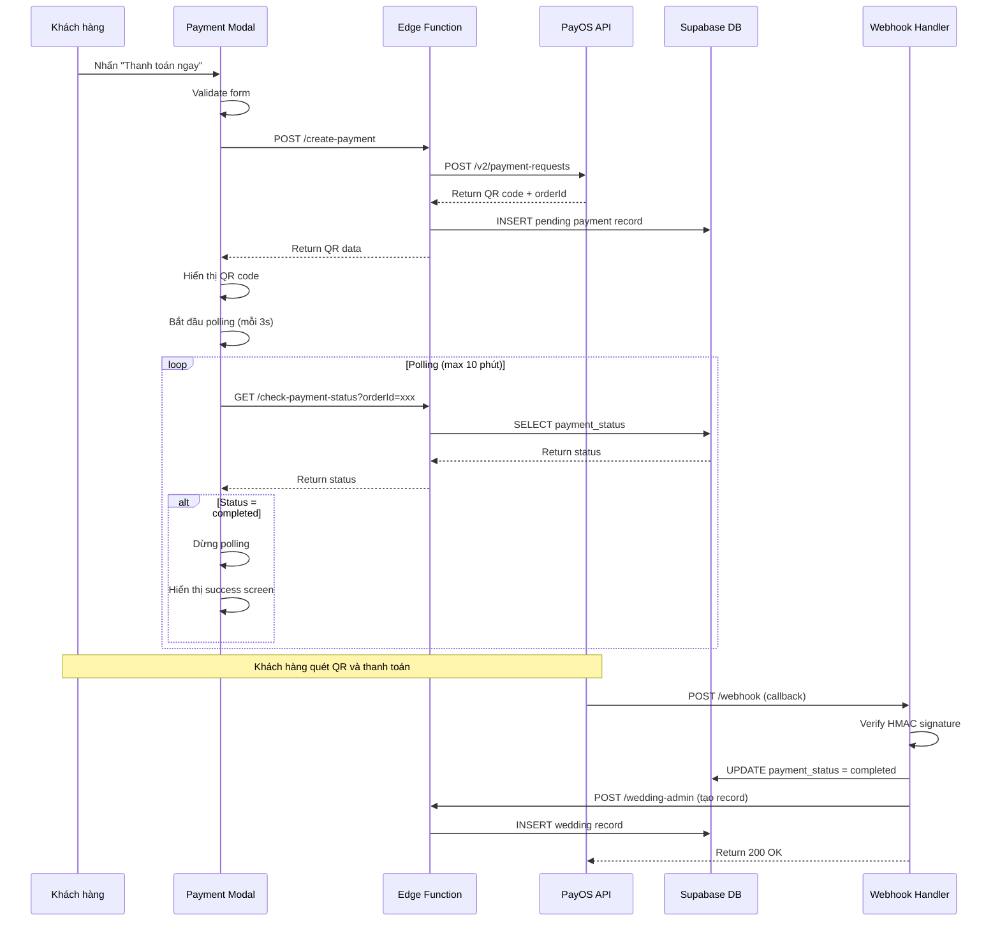

# Design Document: Online Payment QR Integration

## Overview

Tính năng này tích hợp cổng thanh toán PayOS vào hệ thống thiệp cưới online, cho phép khách hàng thanh toán thực tế qua QR code thay vì thanh toán giả lập. Hệ thống sẽ:

- Tạo mã QR thanh toán theo chuẩn VietQR khi khách hàng xác nhận đơn hàng
- Hiển thị mã QR và thông tin chuyển khoản trong Payment Modal
- Polling trạng thái thanh toán mỗi 3 giây để phát hiện thanh toán thành công
- Nhận webhook từ PayOS khi giao dịch hoàn tất
- Tự động tạo wedding record và cập nhật trạng thái đơn hàng
- Xử lý timeout, retry và các trường hợp lỗi

**Lý do chọn PayOS:**

- Cá nhân không cần GPKD, chỉ cần CCCD
- Phí giao dịch: 1.5%
- Free tier: 50 giao dịch/tháng
- Webhook realtime
- Rút tiền miễn phí, 1-2 ngày

**Tương thích với hệ thống hiện tại:**

- Giữ nguyên cấu trúc Payment Modal 3 bước
- Thay thế fake delay 1.5s bằng QR payment flow
- Tương thích với Edge Function wedding-admin hiện có
- Không breaking changes với localStorage order management

## Architecture

### High-Level Architecture

```
┌─────────────────────────────────────────────────────────────────┐
│                    FRONTEND (GitHub Pages)                       │
│                                                                  │
│  payment.js (Payment Modal)                                     │
│    ├─ Step 1: Form nhập thông tin                              │
│    ├─ Step 2: Hiển thị QR + Polling (mỗi 3s)                   │
│    └─ Step 3: Success screen                                    │
└────────┬────────────────────────────────┬─────────────────────┘
         │                                 │
         │ POST /create-payment            │ GET /check-payment-status
         │                                 │ (polling mỗi 3s)
         ▼                                 ▼
┌─────────────────────────────────────────────────────────────────┐
│              SUPABASE EDGE FUNCTIONS                             │
│                                                                  │
│  payment-handler (NEW)                                          │
│    ├─ POST /create-payment                                      │
│    │   └─ Call PayOS API → Tạo payment link + QR               │
│    ├─ GET /check-payment-status?orderId=xxx                     │
│    │   └─ Query weddings table payment_status                   │
│    └─ POST /webhook (PayOS callback)                            │
│        ├─ Verify HMAC-SHA256 signature                          │
│        ├─ Update weddings table                                 │
│        └─ Call wedding-admin POST để tạo record                 │
│                                                                  │
│  wedding-admin (EXISTING)                                       │
│    └─ POST /wedding-admin (tạo wedding record)                  │
└────────┬────────────────────────────────────────────────────────┘
         │
         │ UPDATE payment_status, transaction_id, payment_time
         ▼
┌─────────────────────────────────────────────────────────────────┐
│              SUPABASE POSTGRESQL                                 │
│                                                                  │
│  weddings table (MODIFIED)                                      │
│    + payment_status (pending/completed/failed)                  │
│    + transaction_id (PayOS transaction ID)                      │
│    + payment_time (timestamp thanh toán)                        │
│    + payment_amount (số tiền đã thanh toán)                     │
└─────────────────────────────────────────────────────────────────┘
         ▲
         │ POST webhook callback
         │
┌─────────────────────────────────────────────────────────────────┐
│                    PAYOS API                                     │
│                                                                  │
│  POST /v2/payment-requests                                      │
│    └─ Tạo payment link + QR code                                │
│  POST {webhook_url} (callback khi thanh toán thành công)        │
│    └─ Gửi signature + transaction data                          │
└─────────────────────────────────────────────────────────────────┘
```

### Payment Flow Sequence



### Component Interaction

**Frontend (payment.js):**

- Quản lý UI Payment Modal
- Gọi API tạo payment
- Hiển thị QR code
- Polling trạng thái thanh toán
- Cập nhật localStorage orders

**Edge Function (payment-handler):**

- Tạo payment request với PayOS
- Kiểm tra trạng thái thanh toán
- Nhận webhook từ PayOS
- Xác thực signature
- Cập nhật database
- Tạo wedding record

**PayOS API:**

- Tạo payment link và QR code
- Xử lý giao dịch ngân hàng
- Gửi webhook callback khi thành công

**Database:**

- Lưu trạng thái thanh toán
- Lưu thông tin giao dịch
- Liên kết payment với wedding record

## Components and Interfaces

### 1. Frontend Component: Payment Modal Enhancement

**File:** `payment.js`

**Modifications:**

```javascript
// Thêm constants
const PAYMENT_API_URL =
  "https://lcobawmkywtxhpezndsh.supabase.co/functions/v1/payment-handler";
const POLLING_INTERVAL = 3000; // 3 seconds
const POLLING_TIMEOUT = 600000; // 10 minutes

// Thêm state management
let pollingTimer = null;
let pollingStartTime = null;

// Thêm functions mới
async function createPayment(orderData) {
  // Call Edge Function để tạo payment với PayOS
}

async function checkPaymentStatus(orderId) {
  // Polling để kiểm tra trạng thái thanh toán
}

function startPolling(orderId) {
  // Bắt đầu polling mỗi 3 giây
}

function stopPolling() {
  // Dừng polling
}

function displayQRCode(qrDataURL, paymentInfo) {
  // Hiển thị QR code và thông tin thanh toán
}

function handlePaymentTimeout() {
  // Xử lý timeout sau 10 phút
}
```

**New UI Elements trong Step 2:**

```html
<!-- Step 2: QR Payment (thay thế processing spinner) -->
<div id="payment-step-2-qr">
  <div class="qr-container">
    
  </div>
  <div class="payment-info">
    <p>Số tiền: <strong>299.000đ</strong></p>
    <p>Ngân hàng: <strong id="bank-name"></strong></p>
    <p>Số tài khoản: <strong id="account-number"></strong></p>
    <p>Tên người nhận: <strong id="account-name"></strong></p>
    <p>Nội dung: <strong id="transfer-content"></strong></p>
  </div>
  <div class="instructions">
    <p>1. Mở ứng dụng ngân hàng</p>
    <p>2. Quét mã QR</p>
    <p>3. Xác nhận thanh toán</p>
  </div>
  <div class="status">
    <div class="spinner"></div>
    <p>Đang chờ thanh toán...</p>
    <p class="timer" id="payment-timer">00:00</p>
  </div>
  <button onclick="PaymentModal.cancelPayment()">Hủy thanh toán</button>
</div>

<!-- Timeout UI -->
<div id="payment-timeout" style="display:none;">
  <p>Chưa nhận được xác nhận thanh toán</p>
  <button onclick="PaymentModal.retryCheck()">Kiểm tra lại</button>
  <button onclick="PaymentModal.createNewPayment()">Tạo mã mới</button>
</div>
```

### 2. Backend Component: Payment Handler Edge Function

**File:** `supabase/functions/payment-handler/index.ts`

**Endpoints:**

#### POST /create-payment

**Request:**

```typescript
interface CreatePaymentRequest {
  manage_id: string; // UUID v4
  customer_name: string;
  customer_phone: string;
  customer_email?: string;
  template_name: string;
  theme: string;
  amount: number; // 299000
}
```

**Response:**

```typescript
interface CreatePaymentResponse {
  success: boolean;
  order_id: string; // PayOS order ID
  qr_code: string; // Base64 QR code image
  payment_info: {
    bank_name: string;
    account_number: string;
    account_name: string;
    amount: number;
    content: string; // Nội dung chuyển khoản chứa manage_id
  };
  error?: string;
}
```

**Logic:**

1. Validate input data
2. Tạo order_id unique (timestamp + random)
3. Call PayOS API `/v2/payment-requests`
4. Lưu pending payment vào database
5. Return QR code và payment info

#### GET /check-payment-status

**Request:**

```typescript
interface CheckPaymentStatusRequest {
  order_id: string;
}
```

**Response:**

```typescript
interface CheckPaymentStatusResponse {
  status: "pending" | "completed" | "failed";
  manage_id?: string;
  slug?: string;
  transaction_id?: string;
  payment_time?: string;
}
```

**Logic:**

1. Query database by order_id
2. Return payment status
3. Nếu completed, return manage_id và slug

#### POST /webhook

**Request (từ PayOS):**

```typescript
interface PayOSWebhookPayload {
  code: string; // "00" = success
  desc: string;
  data: {
    orderCode: number;
    amount: number;
    description: string; // Chứa manage_id
    accountNumber: string;
    reference: string; // Transaction ID
    transactionDateTime: string;
  };
  signature: string; // HMAC-SHA256
}
```

**Response:**

```typescript
{
  success: boolean;
  error?: string;
}
```

**Logic:**

1. Verify HMAC-SHA256 signature
2. Extract manage_id từ description
3. Validate amount = 299000
4. Check transaction_id chưa xử lý
5. Update payment_status = 'completed'
6. Call wedding-admin POST để tạo wedding record
7. Return 200 OK

### 3. PayOS API Integration

**Base URL:** `https://api-merchant.payos.vn`

**Authentication:** API Key trong header

**Endpoint sử dụng:**

#### POST /v2/payment-requests

**Request:**

```json
{
  "orderCode": 1234567890,
  "amount": 299000,
  "description": "Thanh toan thiep cuoi - {manage_id}",
  "returnUrl": "https://yourdomain.com/payment-success",
  "cancelUrl": "https://yourdomain.com/payment-cancel",
  "signature": "HMAC-SHA256-signature"
}
```

**Response:**

```json
{
  "code": "00",
  "desc": "success",
  "data": {
    "bin": "970422",
    "accountNumber": "1234567890",
    "accountName": "NGUYEN VAN A",
    "amount": 299000,
    "description": "Thanh toan thiep cuoi - {manage_id}",
    "orderCode": 1234567890,
    "paymentLinkId": "abc123",
    "status": "PENDING",
    "checkoutUrl": "https://pay.payos.vn/abc123",
    "qrCode": "data:image/png;base64,..."
  }
}
```

**Signature Generation:**

```typescript
function generateSignature(data: any, secretKey: string): string {
  const sortedData = sortObjectKeys(data);
  const dataString = objectToQueryString(sortedData);
  return crypto
    .createHmac("sha256", secretKey)
    .update(dataString)
    .digest("hex");
}
```

### 4. Database Schema Changes

**Thêm columns vào bảng `weddings`:**

```sql
ALTER TABLE weddings
ADD COLUMN payment_status TEXT DEFAULT 'pending',
ADD COLUMN payment_order_id TEXT UNIQUE,
ADD COLUMN transaction_id TEXT,
ADD COLUMN payment_time TIMESTAMPTZ,
ADD COLUMN payment_amount INTEGER;

CREATE INDEX idx_weddings_payment_order_id ON weddings(payment_order_id);
CREATE INDEX idx_weddings_transaction_id ON weddings(transaction_id);

COMMENT ON COLUMN weddings.payment_status IS 'Trạng thái thanh toán: pending, completed, failed';
COMMENT ON COLUMN weddings.payment_order_id IS 'PayOS order ID';
COMMENT ON COLUMN weddings.transaction_id IS 'PayOS transaction reference';
COMMENT ON COLUMN weddings.payment_time IS 'Thời gian thanh toán thành công';
COMMENT ON COLUMN weddings.payment_amount IS 'Số tiền đã thanh toán (VND)';
```

**Tạo bảng mới `payment_logs` để audit:**

```sql
CREATE TABLE payment_logs (
  id UUID DEFAULT gen_random_uuid() PRIMARY KEY,
  order_id TEXT NOT NULL,
  manage_id UUID,
  event_type TEXT NOT NULL, -- 'created', 'webhook_received', 'completed', 'failed'
  payload JSONB,
  created_at TIMESTAMPTZ DEFAULT NOW()
);

CREATE INDEX idx_payment_logs_order_id ON payment_logs(order_id);
CREATE INDEX idx_payment_logs_manage_id ON payment_logs(manage_id);
```

## Data Models

### Payment Request Model

```typescript
interface PaymentRequest {
  manage_id: string; // UUID v4 client-generated
  order_id: string; // PayOS order code (timestamp-based)
  customer_name: string;
  customer_phone: string;
  customer_email?: string;
  template_name: string;
  theme: string;
  amount: number; // 299000
  status: "pending" | "completed" | "failed";
  created_at: Date;
  expires_at: Date; // created_at + 10 minutes
}
```

### Payment Response Model

```typescript
interface PaymentResponse {
  order_id: string;
  qr_code: string; // Base64 image data URL
  payment_info: {
    bank_name: string;
    account_number: string;
    account_name: string;
    amount: number;
    content: string;
  };
  checkout_url: string; // PayOS payment page URL
}
```

### Webhook Payload Model

```typescript
interface WebhookPayload {
  code: string; // "00" = success
  desc: string;
  data: {
    orderCode: number;
    amount: number;
    description: string; // Contains manage_id
    accountNumber: string;
    reference: string; // Transaction ID
    transactionDateTime: string;
  };
  signature: string;
}
```

### Wedding Record Update Model

```typescript
interface WeddingPaymentUpdate {
  payment_status: "completed";
  payment_order_id: string;
  transaction_id: string;
  payment_time: Date;
  payment_amount: number;
}
```

### LocalStorage Order Model (Updated)

```typescript
interface Order {
  id: string; // "CX" + timestamp
  templateName: string;
  status: "pending" | "completed" | "cancelled";
  date: string; // ISO string
  customerName: string;
  customerPhone: string;
  customerEmail?: string;
  manage_id: string; // UUID v4
  slug?: string; // Sau khi tạo wedding record
  payment_order_id?: string; // PayOS order ID
  transaction_id?: string; // PayOS transaction reference
  payment_time?: string; // ISO string
}
```

### Error Response Model

```typescript
interface ErrorResponse {
  success: false;
  error: string;
  error_code?: string;
  details?: any;
}
```

### Payment Status Check Model

```typescript
interface PaymentStatusResponse {
  status: "pending" | "completed" | "failed" | "expired";
  manage_id?: string;
  slug?: string;
  transaction_id?: string;
  payment_time?: string;
  elapsed_time?: number; // Seconds since payment created
  remaining_time?: number; // Seconds until timeout
}
```

## Correctness Properties

_A property is a characteristic or behavior that should hold true across all valid executions of a system-essentially, a formal statement about what the system should do. Properties serve as the bridge between human-readable specifications and machine-verifiable correctness guarantees._

### Property Reflection

Sau khi phân tích 70 acceptance criteria, tôi đã xác định các property trùng lặp và có thể kết hợp:

**Redundancies identified:**

- 3.2 và 8.1: Cùng yêu cầu xác thực HMAC-SHA256 signature → Combine thành 1 property
- 2.5 và 9.2: Cùng yêu cầu hiển thị timeout message → Combine
- 2.6 và 9.3: Cùng yêu cầu nút "Kiểm tra lại" → Combine
- 5.2, 5.3, 5.4: Cùng yêu cầu lưu payment data vào localStorage → Combine thành 1 property về payment data persistence
- 3.4, 3.5, 3.6: Cùng về webhook update database → Combine thành 1 property về webhook success handling
- 4.4, 4.5, 4.6: Cùng về set default values cho wedding record → Combine
- 6.5, 6.6, 6.7: Cùng về success screen buttons → Combine thành 1 property về UI controls
- 10.5 duplicate với 5.x requirements

**Properties to combine:**

- Signature verification (3.2 + 8.1)
- Timeout handling UI (2.5 + 2.6 + 9.2 + 9.3)
- LocalStorage payment data (5.2 + 5.3 + 5.4)
- Webhook database update (3.4 + 3.5 + 3.6)
- Wedding record defaults (4.4 + 4.5 + 4.6)
- Success screen controls (6.5 + 6.6 + 6.7)

Sau khi loại bỏ redundancy, còn lại khoảng 45 unique properties cần implement.

### Property 1: QR Code Display on Payment Initiation

_For any_ payment request, when the user clicks "Thanh toán ngay" and form validation passes, the Payment Modal should display a QR code element.

**Validates: Requirements 1.1**

### Property 2: QR Code VietQR Format Compliance

_For any_ generated QR code, decoding it should reveal payment information containing amount = 299000 VND and description containing the manage_id.

**Validates: Requirements 1.2**

### Property 3: Payment Information Display Completeness

_For any_ payment session, the Payment Modal should display all required payment information fields: account number, account name, amount, and transfer content.

**Validates: Requirements 1.3**

### Property 4: Polling Interval Consistency

_For any_ active payment session, the Payment Modal should call the check-payment-status endpoint at 3-second intervals (±100ms tolerance).

**Validates: Requirements 2.1**

### Property 5: Polling API Call Correctness

_For any_ polling request, the GET endpoint should be called with the correct manage_id parameter.

**Validates: Requirements 2.2**

### Property 6: Polling Termination on Success

_For any_ payment session, when payment status changes to "completed", the polling timer should be cleared and no further polling requests should be made.

**Validates: Requirements 2.3, 2.4**

### Property 7: Webhook Signature Verification

_For any_ incoming webhook request, the signature should be verified using HMAC-SHA256 with the secret key, and requests with invalid signatures should be rejected with HTTP 401.

**Validates: Requirements 3.2, 3.3, 8.1**

### Property 8: Webhook Success Handling

_For any_ valid webhook with code "00", the system should update payment_status to "completed", save transaction_id, payment_time, and amount to the database, and return HTTP 200.

**Validates: Requirements 3.4, 3.5, 3.6**

### Property 9: Wedding Record Creation with Manage ID

_For any_ successful payment webhook, a wedding record should be created with the manage_id extracted from the payment description.

**Validates: Requirements 4.1**

### Property 10: Slug Generation from Customer Info

_For any_ wedding record creation, the slug should be generated by normalizing (removing Vietnamese diacritics, lowercasing) the customer name and phone number, joined by hyphen.

**Validates: Requirements 4.2**

### Property 11: Slug Conflict Resolution

_For any_ slug that already exists in the database, the system should append a numeric suffix (-2, -3, ...) until a unique slug is found.

**Validates: Requirements 4.3**

### Property 12: Wedding Record Default Values

_For any_ newly created wedding record after payment, the fields theme, is_active, and payment_status should be set to the selected theme, true, and "completed" respectively.

**Validates: Requirements 4.4, 4.5, 4.6**

### Property 13: Order Status Transition

_For any_ order in localStorage with status "pending", when payment is detected as completed, the status should be updated to "completed".

**Validates: Requirements 5.1**

### Property 14: Payment Data Persistence in LocalStorage

_For any_ completed payment, the order in localStorage should contain manage_id, transaction_id, and payment_time fields with non-null values.

**Validates: Requirements 5.2, 5.3, 5.4**

### Property 15: Authenticated User Storage Key

_For any_ payment by an authenticated user, the order should be stored in localStorage with key "orders\_{user_email}".

**Validates: Requirements 5.5**

### Property 16: Guest User Storage Key

_For any_ payment by a non-authenticated user, the order should be stored in localStorage with key "guestOrders" or "orders\_{entered_email}".

**Validates: Requirements 5.6**

### Property 17: Success Screen Data Display

_For any_ successful payment, the success screen should display customer name, phone number, and template name matching the order data.

**Validates: Requirements 6.3**

### Property 18: Manage Link Generation

_For any_ successful payment, the displayed manage link should follow the format "/manage-by-customer.html?id={manage_id}" where manage_id is a valid UUID v4.

**Validates: Requirements 6.4**

### Property 19: Success Screen Interactive Controls

_For any_ success screen, there should be functional buttons for "Copy link", "Thiết lập ngay" (with correct href), and "Đóng" (closes modal).

**Validates: Requirements 6.5, 6.6, 6.7**

### Property 20: API Error Message Display

_For any_ API error response, the Payment Modal should display the error message from the response or a generic error message if none is provided.

**Validates: Requirements 7.1**

### Property 21: Retry Button on Error

_For any_ error state, the Payment Modal should display a "Thử lại" button that allows creating a new payment request.

**Validates: Requirements 7.4**

### Property 22: Form State Preservation on Error

_For any_ error occurrence, the form fields (name, phone, email) should retain their values from before the error.

**Validates: Requirements 7.5**

### Property 23: Error Logging

_For any_ error in the payment flow, the error should be logged to console with sufficient detail for debugging.

**Validates: Requirements 7.6**

### Property 24: Manage ID Extraction from Payment Description

_For any_ webhook payload, the manage_id should be successfully extracted from the payment description field.

**Validates: Requirements 8.3**

### Property 25: Payment Amount Validation

_For any_ webhook payload, if the amount field does not equal 299000, the webhook should return HTTP 400 Bad Request.

**Validates: Requirements 8.4**

### Property 26: Transaction Idempotency

_For any_ transaction_id, if a webhook with that transaction_id has already been processed, subsequent webhooks with the same transaction_id should be rejected or ignored.

**Validates: Requirements 8.5**

### Property 27: Validation Failure Response

_For any_ webhook validation failure (signature, amount, manage_id, duplicate transaction), the webhook should return HTTP 400 and log the specific validation error.

**Validates: Requirements 8.6**

### Property 28: Manual Status Check

_For any_ user action clicking "Kiểm tra lại", the system should make exactly one API call to check-payment-status endpoint.

**Validates: Requirements 9.5**

### Property 29: Pending Status Fallback Message

_For any_ manual status check that returns "pending", the UI should display instructions to contact support.

**Validates: Requirements 9.6**

### Property 30: Auto-fill Preservation

_For any_ logged-in user opening the Payment Modal, the form fields should be pre-filled with user's name, phone, and email from their profile.

**Validates: Requirements 10.3**

### Property 31: Form Validation Rules Preservation

_For any_ form submission attempt, the name and phone fields should be validated as required (non-empty), and submission should be blocked if validation fails.

**Validates: Requirements 10.4**

### Property 32: Wedding Admin Endpoint Compatibility

_For any_ POST request to /wedding-admin endpoint with valid id and slug, the endpoint should create a wedding record and return the created id and slug.

**Validates: Requirements 10.6**

### Property 33: Feature Flag Behavior

_For any_ payment flow when USE_REAL_PAYMENT feature flag is false, the system should use the existing fake payment delay (1.5s) instead of calling PayOS API.

**Validates: Requirements 10.7**

## Error Handling

### Error Categories

**1. Network Errors**

- Connection timeout
- DNS resolution failure
- Network unreachable

**Handling:**

- Display user-friendly message: "Lỗi kết nối, vui lòng kiểm tra mạng"
- Preserve form state
- Provide "Thử lại" button
- Log error details to console

**2. API Errors**

- PayOS API returns error response
- Edge Function returns 4xx/5xx
- Invalid response format

**Handling:**

- Parse error message from response
- Display specific error message if available
- Fallback to generic message
- Log full error response
- Preserve form state

**3. Validation Errors**

- Invalid form input (empty name/phone)
- Invalid signature in webhook
- Amount mismatch
- Duplicate transaction

**Handling:**

- Display field-specific error messages
- Highlight invalid fields
- Block submission until fixed
- For webhook: return appropriate HTTP status code

**4. Timeout Errors**

- Polling exceeds 10 minutes
- Payment not confirmed

**Handling:**

- Stop polling
- Display timeout message
- Provide "Kiểm tra lại" button
- Provide "Tạo mã mới" button
- Preserve order in localStorage as "pending"

**5. Business Logic Errors**

- Slug conflict (handled by auto-suffix)
- Manage ID not found
- Wedding record already exists

**Handling:**

- Automatic retry with modified data
- Log warning
- Return appropriate error response

### Error Recovery Strategies

**Retry Logic:**

- Network errors: Allow immediate retry
- API errors: Allow retry after 3 seconds
- Timeout: Allow manual check or new payment creation

**State Management:**

- Always preserve form data on error
- Save "pending" orders to localStorage immediately
- Update to "completed" only after confirmation
- Never lose customer data

**User Communication:**

- Clear, actionable error messages in Vietnamese
- Avoid technical jargon
- Provide next steps
- Show support contact for unrecoverable errors

### Webhook Error Handling

**Invalid Signature:**

```typescript
if (!verifySignature(payload, signature)) {
  logError("Invalid webhook signature", { payload });
  return new Response("Unauthorized", { status: 401 });
}
```

**Amount Mismatch:**

```typescript
if (payload.data.amount !== 299000) {
  logError("Amount mismatch", {
    expected: 299000,
    received: payload.data.amount,
  });
  return new Response("Invalid amount", { status: 400 });
}
```

**Duplicate Transaction:**

```typescript
const existing = await checkTransactionExists(payload.data.reference);
if (existing) {
  logWarning("Duplicate transaction", {
    transactionId: payload.data.reference,
  });
  return new Response("Already processed", { status: 200 }); // Idempotent
}
```

**Database Error:**

```typescript
try {
  await updatePaymentStatus(manage_id, transactionData);
} catch (error) {
  logError("Database update failed", { error, manage_id });
  return new Response("Internal server error", { status: 500 });
}
```

## Testing Strategy

### Dual Testing Approach

Tính năng này yêu cầu cả **unit tests** và **property-based tests** để đảm bảo độ tin cậy cao:

**Unit Tests** - Kiểm tra các trường hợp cụ thể:

- Specific examples: QR code với manage_id cụ thể
- Edge cases: Timeout sau 10 phút, network errors
- Integration points: PayOS API integration, webhook signature verification
- Error conditions: Invalid signature, amount mismatch, duplicate transaction

**Property-Based Tests** - Kiểm tra tính đúng đắn tổng quát:

- Universal properties: Slug generation, signature verification, polling behavior
- Randomized inputs: Random customer names, phone numbers, manage_ids
- Comprehensive coverage: 100+ iterations per property test

### Property-Based Testing Configuration

**Library:** `fast-check` (JavaScript/TypeScript)

**Configuration:**

```typescript
import fc from 'fast-check';

// Minimum 100 iterations per test
fc.assert(
  fc.property(/* generators */, (/* inputs */) => {
    // Test property
  }),
  { numRuns: 100 }
);
```

**Test Tagging Format:**

```typescript
// Feature: online-payment-qr-integration, Property 10: Slug Generation from Customer Info
test("slug generation removes diacritics and lowercases", () => {
  fc.assert(
    fc.property(
      fc.string(), // customer name
      fc.string(), // phone number
      (name, phone) => {
        const slug = generateSlug(name, phone);
        // Verify no diacritics, all lowercase, hyphen-separated
        expect(slug).toMatch(/^[a-z0-9-]+$/);
      },
    ),
    { numRuns: 100 },
  );
});
```

### Test Coverage by Component

#### Frontend (payment.js)

**Unit Tests:**

- Modal open/close behavior
- Form validation (empty name, empty phone)
- QR code display after API response
- Polling start/stop logic
- Timer display formatting
- LocalStorage order management
- Success screen rendering
- Error message display
- Feature flag toggle

**Property Tests:**

- Property 1: QR display on payment initiation
- Property 4: Polling interval consistency
- Property 5: Polling API call correctness
- Property 6: Polling termination on success
- Property 13: Order status transition
- Property 14: Payment data persistence
- Property 15: Authenticated user storage key
- Property 16: Guest user storage key
- Property 30: Auto-fill preservation
- Property 31: Form validation rules

**Example Unit Test:**

```typescript
describe("Payment Modal", () => {
  test("displays QR code after successful payment creation", async () => {
    const mockResponse = {
      order_id: "test-123",
      qr_code: "data:image/png;base64,...",
      payment_info: {
        /* ... */
      },
    };

    global.fetch = jest.fn().mockResolvedValue({
      ok: true,
      json: async () => mockResponse,
    });

    await PaymentModal.process();

    const qrImage = document.getElementById("qr-code-image");
    expect(qrImage.src).toBe(mockResponse.qr_code);
  });
});
```

#### Backend (payment-handler Edge Function)

**Unit Tests:**

- PayOS API integration (mock responses)
- Signature generation
- Webhook signature verification
- Database insert/update operations
- Error response formatting
- Timeout handling

**Property Tests:**

- Property 2: QR code VietQR format compliance
- Property 7: Webhook signature verification
- Property 8: Webhook success handling
- Property 9: Wedding record creation
- Property 10: Slug generation
- Property 11: Slug conflict resolution
- Property 12: Wedding record defaults
- Property 24: Manage ID extraction
- Property 25: Payment amount validation
- Property 26: Transaction idempotency
- Property 27: Validation failure response

**Example Property Test:**

```typescript
// Feature: online-payment-qr-integration, Property 10: Slug Generation from Customer Info
describe("Slug Generation", () => {
  test("removes Vietnamese diacritics and lowercases", () => {
    fc.assert(
      fc.property(
        fc.string({ minLength: 1 }),
        fc.string({ minLength: 1 }),
        (name, phone) => {
          const slug = generateSlug(name, phone);

          // Should only contain lowercase letters, numbers, and hyphens
          expect(slug).toMatch(/^[a-z0-9-]+$/);

          // Should not contain Vietnamese diacritics
          expect(slug).not.toMatch(
            /[àáạảãâầấậẩẫăằắặẳẵèéẹẻẽêềếệểễìíịỉĩòóọỏõôồốộổỗơờớợởỡùúụủũưừứựửữỳýỵỷỹđ]/i,
          );
        },
      ),
      { numRuns: 100 },
    );
  });
});
```

**Example Unit Test:**

```typescript
describe("Webhook Handler", () => {
  test("rejects webhook with invalid signature", async () => {
    const payload = {
      code: "00",
      data: {
        /* ... */
      },
      signature: "invalid-signature",
    };

    const response = await handleWebhook(payload);

    expect(response.status).toBe(401);
  });

  test("rejects webhook with wrong amount", async () => {
    const payload = {
      code: "00",
      data: { amount: 100000 /* ... */ },
      signature: generateValidSignature(/* ... */),
    };

    const response = await handleWebhook(payload);

    expect(response.status).toBe(400);
    expect(await response.text()).toContain("Invalid amount");
  });
});
```

#### Integration Tests

**Scenarios:**

1. End-to-end payment flow (mock PayOS)
2. Webhook → Database → Frontend polling
3. Timeout → Manual check → Success
4. Error → Retry → Success
5. Duplicate webhook handling

**Example Integration Test:**

```typescript
describe("Payment Flow Integration", () => {
  test("complete payment flow from modal to success", async () => {
    // 1. Open modal
    PaymentModal.open("Template 1", "template1");

    // 2. Fill form
    document.getElementById("payment-name").value = "Nguyễn Văn A";
    document.getElementById("payment-phone").value = "0912345678";

    // 3. Submit payment
    await PaymentModal.process();

    // 4. Verify QR displayed
    expect(document.getElementById("payment-step-2-qr").style.display).toBe(
      "flex",
    );

    // 5. Simulate webhook callback
    await simulateWebhook({
      /* success payload */
    });

    // 6. Wait for polling to detect success
    await waitFor(() => {
      expect(document.getElementById("payment-step-3").style.display).toBe(
        "flex",
      );
    });

    // 7. Verify localStorage updated
    const orders = JSON.parse(localStorage.getItem("guestOrders"));
    expect(orders[0].status).toBe("completed");
  });
});
```

### Test Data Generators

**For Property-Based Tests:**

```typescript
// Vietnamese name generator
const vietnameseNameArb = fc.string().map((s) => {
  const names = ["Nguyễn Văn A", "Trần Thị B", "Lê Minh C", "Phạm Hồng D"];
  return names[Math.floor(Math.random() * names.length)];
});

// Phone number generator
const phoneNumberArb = fc
  .integer({ min: 900000000, max: 999999999 })
  .map((n) => `0${n}`);

// Manage ID generator (UUID v4)
const manageIdArb = fc.uuid();

// Payment amount generator (with some invalid values)
const paymentAmountArb = fc.oneof(
  fc.constant(299000), // Valid
  fc.integer({ min: 1000, max: 1000000 }), // Invalid
);
```

### Mocking Strategy

**PayOS API Mock:**

```typescript
const mockPayOSAPI = {
  createPayment: jest.fn().mockResolvedValue({
    code: "00",
    data: {
      orderCode: 1234567890,
      qrCode: "data:image/png;base64,...",
      checkoutUrl: "https://pay.payos.vn/...",
      /* ... */
    },
  }),

  sendWebhook: jest.fn(), // For testing webhook reception
};
```

**Supabase Mock:**

```typescript
const mockSupabase = {
  from: jest.fn().mockReturnValue({
    insert: jest.fn().mockResolvedValue({ data: {}, error: null }),
    update: jest.fn().mockResolvedValue({ data: {}, error: null }),
    select: jest.fn().mockReturnValue({
      eq: jest.fn().mockReturnValue({
        single: jest.fn().mockResolvedValue({ data: {}, error: null }),
      }),
    }),
  }),
};
```

### Performance Testing

**Polling Performance:**

- Verify polling doesn't cause memory leaks
- Verify timer cleanup on success/timeout
- Measure CPU usage during 10-minute polling

**Database Performance:**

- Measure webhook processing time (target: <500ms)
- Verify index usage for payment_order_id lookups
- Test concurrent webhook handling

### Security Testing

**Signature Verification:**

- Test with valid signatures (should accept)
- Test with invalid signatures (should reject)
- Test with missing signatures (should reject)
- Test with tampered payloads (should reject)

**SQL Injection:**

- Test manage_id with SQL injection attempts
- Test slug with special characters
- Verify parameterized queries

**XSS Prevention:**

- Test customer name with script tags
- Test error messages with HTML
- Verify proper escaping

### Manual Testing Checklist

- [ ] QR code displays correctly on mobile devices
- [ ] QR code scannable by banking apps (VietinBank, BIDV, etc.)
- [ ] Polling works in background tab
- [ ] Timeout message appears after 10 minutes
- [ ] Success screen displays correct information
- [ ] Copy link button works
- [ ] "Thiết lập ngay" button navigates correctly
- [ ] Error messages are clear and helpful
- [ ] Form data preserved after errors
- [ ] Feature flag toggle works correctly
