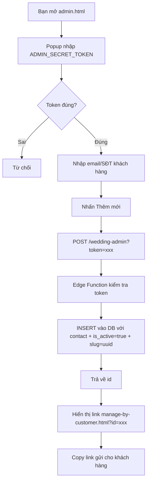
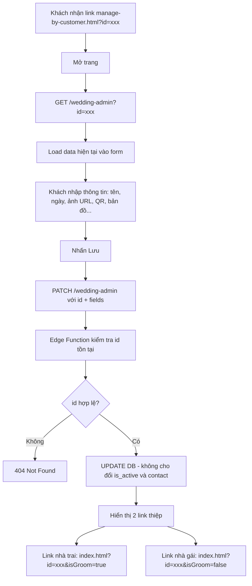
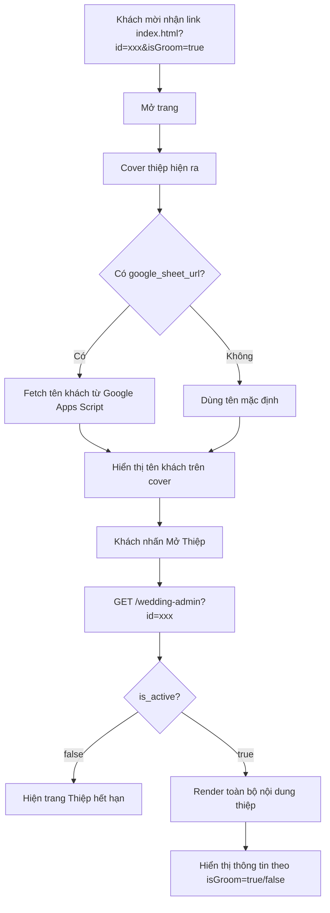

# Kiến Trúc Project - Web Thiệp Cưới Online

## Tổng Quan Hệ Thống

```
┌─────────────────────────────────────────────────────────────┐
│                      GITHUB PAGES (Free)                     │
│                                                              │
│   admin.html          manage-by-customer.html   index.html  │
│   (Tạo thiệp)         (Khách nhập thông tin)    (Xem thiệp) │
└──────────┬───────────────────┬──────────────────────┬───────┘
           │                   │                      │
           │ POST+token        │ GET/PATCH+id          │ GET+id
           ▼                   ▼                      ▼
┌─────────────────────────────────────────────────────────────┐
│              SUPABASE EDGE FUNCTION (Free)                   │
│                   wedding-admin                              │
│                                                              │
│  POST  → Kiểm tra ADMIN_SECRET_TOKEN → INSERT               │
│  PATCH → Kiểm tra id tồn tại → UPDATE                       │
│  GET   → Public → SELECT                                     │
└──────────────────────────┬──────────────────────────────────┘
                           │ service_role_key
                           ▼
┌─────────────────────────────────────────────────────────────┐
│              SUPABASE POSTGRESQL (Free 500MB)                │
│                    Bảng: weddings                            │
│                                                              │
│  id, slug, is_active, contact                               │
│  groom_name, bride_name, story_quote, cover_image_url        │
│  gallery_images[]                                            │
│  ceremony_* (lễ thành hôn CHUNG: date, time, lunar)         │
│  groom_* (father, mother, address, image, google_sheet,     │
│           party, map, bank, qr)                              │
│  bride_* (father, mother, address, image, google_sheet,     │
│           party, map, bank, qr)                              │
└─────────────────────────────────────────────────────────────┘
```

---

## Sơ Đồ Luồng

### Luồng 1: Admin Tạo Thiệp Mới



### Luồng 2: Khách Hàng Nhập Thông Tin



### Luồng 3: Khách Mời Xem Thiệp



---

## Cấu Trúc Thư Mục

```
WebCuoi/
├── index.html                          # Thiệp cưới (trang khách xem)
├── script.js                           # Logic JS: carousel, lightbox, calendar, RSVP...
├── style.css                           # Custom CSS (font, animation, shimmer...)
├── supabase.js                         # Fetch data từ Supabase & render vào thiệp
├── admin.html                          # Trang tạo thiệp mới (chỉ bạn dùng)
├── manage-by-customer.html             # Trang khách hàng nhập thông tin thiệp
├── ARCHITECTURE.md                     # File này
├── assets/
│   ├── fonts/
│   │   ├── TheNautigal-Regular.ttf     # Font chữ viết tay tên cặp đôi
│   │   └── katty-diona.woff2           # Font "Wedding Invitation" trên cover
│   ├── images/                         # Ảnh mẫu, QR, icon...
│   └── musics/                         # Nhạc nền
└── supabase/
    └── functions/
        └── wedding-admin/
            └── index.ts                # Edge Function: tạo/đọc/cập nhật thiệp
```

---

## Chi Tiết Các File

### `index.html`

Thiệp cưới chính. Gồm 6 block:

1. **Cover** — Ảnh nền + tên khách + nút mở thiệp
2. **Save The Date** — Ảnh cặp đôi + quote
3. **Thông tin gia đình** — Nhà trai + nhà gái (ảnh + tên bố mẹ + địa chỉ)
4. **Thư mời + Tiệc cưới** — Ngày giờ + lịch mini + xác nhận tham dự + gallery
5. **Hộp mừng cưới** — QR chuyển khoản
6. **Bản đồ** — Google Maps thumbnail + điều hướng

### `script.js`

- Carousel ảnh (3D effect, swipe, lightbox, pinch zoom)
- Mini calendar (tự tính âm lịch fallback)
- RSVP buttons (animation idle pulse + pop)
- Scroll reveal animations
- iOS viewport height fix
- Save QR (Web Share API)

### `supabase.js`

- Fetch data từ Edge Function theo `id` trên URL
- Render data vào các element có `id` tương ứng
- Load tên khách từ Google Apps Script
- Hiện trang expired nếu `is_active = false`

### `admin.html`

- Nhập mã quản trị qua popup (lưu sessionStorage)
- POST tạo bản ghi mới → nhận id → hiển thị link manage

### `manage-by-customer.html`

- Load data hiện tại theo id
- Form đầy đủ tất cả trường trong DB
- PATCH cập nhật → hiển thị 2 link thiệp

### `supabase/functions/wedding-admin/index.ts`

- Deno runtime (Supabase Edge Functions)
- POST: cần ADMIN_SECRET_TOKEN, tạo bản ghi mới
- PATCH: chỉ cần id, cập nhật thông tin (không cho đổi is_active/contact)
- GET: public, lấy thông tin theo id

---

## Bảo Mật

| Thao tác               | Ai được phép     | Cơ chế                                    |
| ---------------------- | ---------------- | ----------------------------------------- |
| Tạo thiệp (POST)       | Chỉ admin        | ADMIN_SECRET_TOKEN trong Supabase Secrets |
| Cập nhật thiệp (PATCH) | Khách hàng có id | UUID v4 (122 bit entropy, khó đoán)       |
| Đọc thiệp (GET)        | Public           | Không cần auth                            |
| Tắt thiệp              | Chỉ admin        | Supabase Dashboard → is_active = false    |
| Xóa thiệp              | Chỉ admin        | Supabase Dashboard                        |

---

## Supabase Config

| Thông tin          | Giá trị                                    |
| ------------------ | ------------------------------------------ |
| Project URL        | `https://lcobawmkywtxhpezndsh.supabase.co` |
| Edge Function      | `/functions/v1/wedding-admin`              |
| Anon Key           | JWT token (dùng cho Authorization header)  |
| ADMIN_SECRET_TOKEN | Lưu trong Supabase Secrets                 |

---

## Công Nghệ & Chi Phí

| Thành phần | Công nghệ                    | Giới hạn free  | Chi phí |
| ---------- | ---------------------------- | -------------- | ------- |
| Frontend   | HTML + Tailwind + Vanilla JS | Không giới hạn | $0      |
| Hosting    | GitHub Pages                 | Không giới hạn | $0      |
| Database   | Supabase PostgreSQL          | 500MB          | $0      |
| Backend    | Supabase Edge Functions      | 500k req/tháng | $0      |
| Fonts      | Google Fonts + Local         | Không giới hạn | $0      |
| **Tổng**   |                              |                | **$0**  |

---

## Mở Rộng Tương Lai

- [ ] Tích hợp Google Sheet để quản lý danh sách khách mời
- [ ] Upload ảnh trực tiếp lên Supabase Storage thay vì nhập URL
- [ ] Thêm nhạc nền động từ DB
- [ ] Dashboard thống kê lượt xem thiệp
- [ ] Gửi email/SMS thông báo cho khách mời
