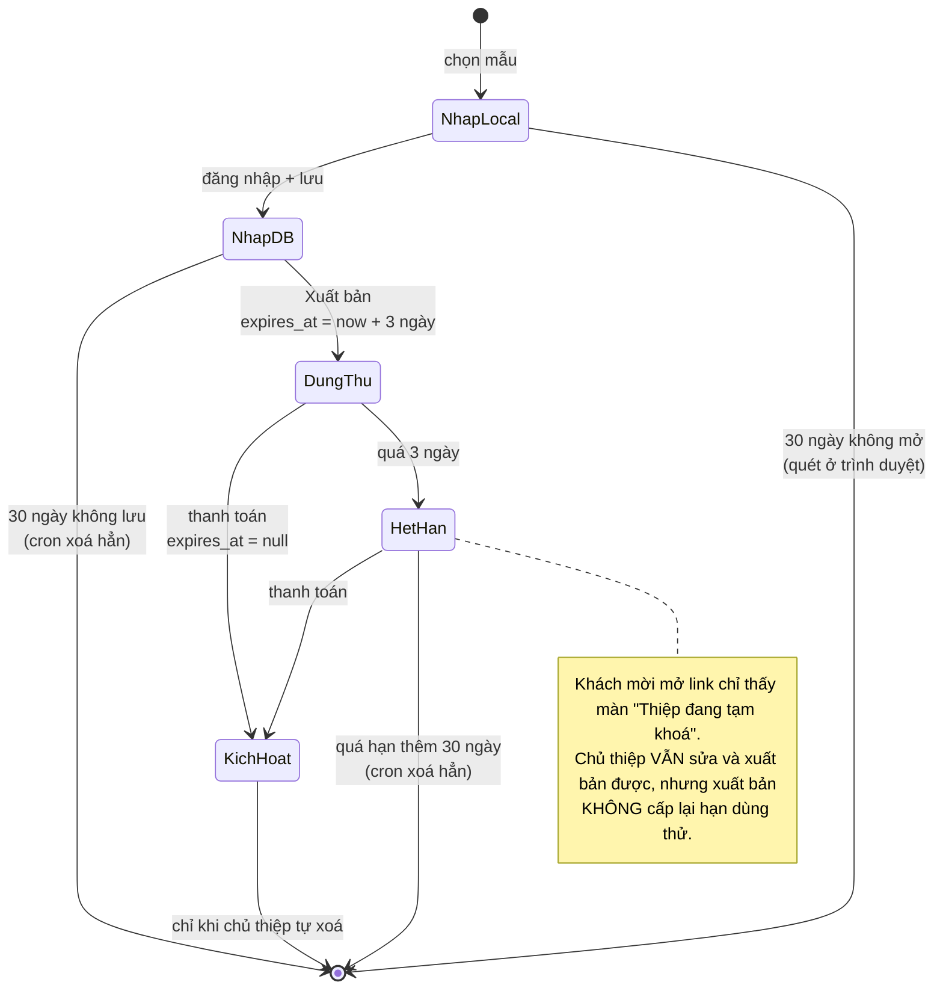

# Dọn dẹp tự động & khoá thiệp hết hạn

Luồng "thiệp/nháp bỏ quên thì tự xoá, thiệp hết hạn dùng thử thì khách mời không xem được".
Đọc file này trước khi sửa bất cứ thứ gì dính tới `expires_at`, hạn giữ dữ liệu, hay màn khoá
trên trang thiệp.

## 1. Vì sao có nó

- Gói Supabase free: 500 MB DB + 1 GB Storage. Thiệp bỏ quên (ảnh cưới cả chục tấm ~1 MB) ăn
  dần cho tới khi hết chỗ.
- Dùng thử 3 ngày trước đây chỉ là cái nhãn: không ai chặn nên thiệp chưa trả tiền vẫn xem
  được vĩnh viễn.

## 2. Vòng đời một thiệp



| Trạng thái | Dấu hiệu trong DB                                                    | Khách mời xem được? |
| ---------- | -------------------------------------------------------------------- | ------------------- |
| Nháp       | `is_published = false`                                               | không (chưa có link) |
| Dùng thử   | `is_published`, `expires_at > now()`                                 | có                  |
| Hết hạn    | `is_published`, `expires_at < now()`, `payment_status <> 'completed'` | **không** — 403     |
| Kích hoạt  | `expires_at is null` hoặc `payment_status = 'completed'`              | có, vĩnh viễn       |

## 3. `expires_at` — ai được ghi, ghi lúc nào

Cột này là **trục của toàn bộ luồng**. Chỉ có ba chỗ chạm vào nó:

| Nơi                   | Khi nào                                                            | Giá trị           |
| --------------------- | ------------------------------------------------------------------ | ----------------- |
| `wedding-admin` PATCH | thiệp CHUYỂN từ chưa xuất bản → xuất bản, và chưa thanh toán        | `now() + 3 ngày`  |
| `payos-webhook`       | thanh toán thành công                                              | `null`            |
| `payment-handler`     | thanh toán 0đ (mã giảm 100%)                                       | `null`            |

⚠️ **Điều kiện "chuyển trạng thái" là bắt buộc, đừng gỡ.** Thiệp đã xuất bản thì nút chính đổi
nhãn thành "Lưu & Xuất bản" nhưng vẫn gọi `publishWedding()`, tức mọi lần lưu đều kèm
`is_published: true`. Bỏ điều kiện là hạn dùng thử tự gia hạn mỗi lần khách bấm lưu → không
thiệp nào hết hạn, không thiệp nào bị dọn, cả tính năng này thành vô nghĩa.

`expires_at` **không bao giờ** rời khỏi DB cho người dùng thường: `wedding-admin` chỉ lấy nó để
xét khoá rồi `delete` khỏi response.

## 4. Ba hạn giữ dữ liệu

Số ngày khai ở `CONFIG.retention` (`core/config.js`) — nguồn sự thật cho MỌI câu chữ hiển thị.

| Loại               | Mốc đếm                             | Ai dọn                                                    |
| ------------------ | ----------------------------------- | --------------------------------------------------------- |
| `unpaidDays`       | `expires_at` (hết hạn dùng thử)     | Edge Function `cleanup-weddings`                          |
| `serverDraftDays`  | `weddings.updated_at` (lần lưu cuối) | Edge Function `cleanup-weddings`                          |
| `localDraftDays`   | `_savedAt` trong localStorage        | `core/helpers/draft-retention.js` (chạy ở trình duyệt)    |

⚠️ Back-end giữ **bản sao** số ngày ở biến môi trường `RETENTION_DAYS` của function
`cleanup-weddings` (mặc định 30). Đổi `CONFIG.retention` mà quên đổi biến này là web nói một
đằng hệ thống làm một nẻo.

## 5. Các mảnh và file

| Mảnh                | File                                                                             | Việc                                                                              |
| ------------------- | -------------------------------------------------------------------------------- | --------------------------------------------------------------------------------- |
| Schema + lịch       | `changelogs/RC1.10/cleanup_retention.sql`                                        | cột `updated_at` + trigger, 2 partial index, bật `pg_cron`/`pg_net`, `cron.schedule` |
| Quét & xoá          | `supabase/functions/cleanup-weddings/index.ts`                                   | 2 câu quét, xoá ảnh Storage rồi xoá hàng                                          |
| Khoá thiệp          | `supabase/functions/wedding-admin/index.ts` (GET một thiệp)                      | slug + hết hạn → 403 `TRIAL_EXPIRED`; theo id → kèm cờ `trial_locked`             |
| Lộ mã lỗi           | `core/dal/wedding-dal.js` → `getWeddingBySlug`                                   | đọc body lỗi, gắn `err.code`                                                      |
| Màn khoá            | `core/helpers/wedding-helper.js` → `showLockedInvitation`                        | overlay phủ kín trang thiệp                                                       |
| Dọn nháp máy khách  | `core/helpers/draft-retention.js`                                                | quét localStorage lúc nạp trang                                                   |
| Câu chữ cho khách   | `my-invitations/index.js`, `invitation-setup/js/05-theme-panel.js`, `13-data.js`, `18-theme-picker.js` | nhãn, tooltip, toast, popup xuất bản                                              |

## 6. Server: `cleanup-weddings`

Không UI nào gọi vào. `pg_cron` gọi qua `pg_net` mỗi ngày **03:00 giờ VN** (`0 20 * * *` UTC),
kèm header `x-admin-token` lấy từ Vault (secret tên `cleanup_token`). Function deploy với
**Verify JWT = OFF** — quyền dựa hoàn toàn vào token đó.

Hai câu quét:

```
(1) unpaid: is_published AND payment_status <> 'completed'
            AND expires_at IS NOT NULL AND expires_at < now() - RETENTION_DAYS
(2) draft:  NOT is_published AND updated_at < now() - RETENTION_DAYS
```

Chốt an toàn: `expires_at IS NULL` hoặc `payment_status = 'completed'` thì **không bao giờ** bị
đụng — đó là thiệp đã kích hoạt vĩnh viễn. Câu (1) dùng `.or('payment_status.is.null,...neq...')`
vì `neq` của PostgREST bỏ sót hàng NULL.

Mỗi nạn nhân: gom tên file từ 5 cột ảnh + `gallery_images` → `storage.remove()` → `delete from
weddings` (guests cascade theo FK). **Xoá ảnh trước**, vì hàng DB là nơi duy nhất còn giữ tên file.

- `?dry_run=1` — chỉ liệt kê, không xoá. Dùng trước mọi thay đổi.
- `?days=N` — ghi đè hạn, để thử tay.
- Trần **100 hàng mỗi nhóm mỗi lần chạy** (`MAX_PER_RUN`), còn dư hôm sau dọn tiếp.
- Log Axiom: `cleanup.run` · `cleanup.deleted` · `cleanup.failed`.

## 7. Khoá thiệp hết hạn

Chặn ở **API**, không phải ở client: link thiệp là công khai, giấu bằng JS thì ai xem source
cũng lấy được dữ liệu.

- **Tra theo `slug`** (đường công khai) + hết hạn → `403 {code:'TRIAL_EXPIRED', groom_name,
  bride_name, theme}`. Không trả một byte dữ liệu thiệp nào.
- **Tra theo `id`** (UUID quản lý, chỉ chủ thiệp có) → không chặn, để trình chỉnh sửa nạp được;
  kèm cờ `trial_locked` để báo cho chủ thiệp biết.
- Trang thiệp: `loadWeddingData` bắt `code === 'TRIAL_EXPIRED'` → `showLockedInvitation()` thay
  vì đá về trang chủ. Overlay viết bằng inline style + biến `--cx-*` (trang thiệp không có
  Tailwind) nên chạy trên mọi theme.
- Trình chỉnh sửa: cờ `IS_TRIAL_LOCKED` (`01-state.js`) đổi popup "Chúc mừng" sau khi xuất bản
  sang khối cảnh báo cam, vì xuất bản lại KHÔNG mở khoá.
- **Xem trước không bị ảnh hưởng**: preview chạy `?preview=true` không có slug → không gọi API.

## 8. Client: dọn nháp trong localStorage

Server không với tới localStorage nên phải quét ở trình duyệt. `draft-retention.js` chạy ngay
khi nạp (landing, `my-invitations`, `invitation-setup`), sau `cache-util.js` và `config.js`:

- Xoá `cuoixinh_draft_<id>` có `_savedAt` quá hạn, gỡ luôn hàng `status: "draft"` tương ứng
  trong cache `orders` để không còn thẻ ma ở "Quản lý thiệp cưới".
- **Nháp chưa có `_savedAt` thì đóng dấu, KHÔNG xoá** — nếu không, bản nháp của khách cũ bay mất
  ngay lần deploy đầu tiên.
- **Bỏ qua id đang mở** (`?id=` trên URL).
- Gọi tay để thử: `cxSweepLocalDrafts()` trong console.

Mốc `_savedAt` do `saveLocalDraft()` (`01-state.js`) và `draft-start.js` đặt. `core/payment.js`
phải strip nó trước khi PATCH lên DB (cùng chỗ strip `_localOnly`).

## 9. Vận hành

```sql
-- Lịch còn sống không
select jobid, jobname, schedule, active from cron.job;

-- Lần chạy gần nhất (job_run_details KHÔNG có cột jobname, phải join)
select j.jobname, d.status, d.start_time, d.return_message
from cron.job_run_details d join cron.job j on j.jobid = d.jobid
order by d.start_time desc limit 5;

-- Function trả về gì
select status_code, content from net._http_response order by created desc limit 5;

-- Dừng gấp (có hiệu lực ngay, không cần deploy)
select cron.unschedule('cx-cleanup-weddings');

-- Cứu một thiệp sắp bị xoá / mở khoá tạm 3 ngày
update weddings set expires_at = now() + interval '3 days' where id = '<id>';

-- Chạy tay (bỏ ?dry_run=1 là xoá thật)
select net.http_post(
  url := 'https://lcobawmkywtxhpezndsh.supabase.co/functions/v1/cleanup-weddings?dry_run=1',
  headers := jsonb_build_object(
    'Content-Type', 'application/json',
    'x-admin-token', (select decrypted_secret from vault.decrypted_secrets where name = 'cleanup_token')
  ),
  body := '{}'::jsonb, timeout_milliseconds := 30000);
```

Deploy lại function: `npm run deploy:functions` (script tự truyền `--no-verify-jwt` cho
`cleanup-weddings`, `guest-handler`, `payos-webhook`).

Đổi token:
`select vault.update_secret((select id from vault.secrets where name='cleanup_token'), '<token mới>');`
— phải khớp biến `ADMIN_SECRET_TOKEN` của Edge Function.

| Triệu chứng                            | Nguyên nhân thường gặp                                              |
| -------------------------------------- | -------------------------------------------------------------------- |
| `status_code = 401`                    | Token Vault khác `ADMIN_SECRET_TOKEN`, hoặc deploy thiếu `--no-verify-jwt` |
| `status_code = 404`                    | Function chưa deploy                                                 |
| `cron.job_run_details` rỗng            | Chưa tới giờ chạy, hoặc lịch đã bị unschedule                        |
| Thiệp hết hạn vẫn xem được vài phút    | Cache Cloudflare (TTL 300s) còn giữ bản 200 cũ                       |
| Nháp cũ không bao giờ bị dọn           | Trigger `cx_touch_weddings_updated_at` bị drop, hoặc `updated_at` bị luồng khác ghi đè |

## 10. Cạm bẫy khi sửa

- **Xoá là xoá hẳn, một pha, không hoàn tác được** — mất luôn ảnh, khách mời, lời chúc. Luôn
  `dry_run` trước khi đổi bất cứ điều kiện quét nào.
- **`RETENTION_DAYS` và `CONFIG.retention` là hai nơi** — đổi phải đổi cả hai.
- **Thêm cột ảnh mới** cho thiệp thì phải thêm vào `IMAGE_COLUMNS` của `cleanup-weddings` **và**
  danh sách xoá ảnh trong `wedding-admin` (nhánh DELETE), nếu không file thành rác vĩnh viễn.
- **Ảnh mồ côi chưa được dọn**: file upload dở rồi khách bỏ đi (chưa nằm ở cột nào) không ai
  xoá. Tên file có tiền tố `<weddingId>-` (`core/bl/image-bl.js`) nên sau này quét theo tiền tố
  được.
- **Bảng tiền không cascade**: `orders` / `payment_logs` / `promo_redemptions` tham chiếu
  `manage_id` mà không có FK, xoá thiệp không xoá chúng — cố ý, để giữ lịch sử tiền bạc.
- **`add column ... default now()` không để lại hàng NULL** (PG11+ điền luôn cho hàng cũ).
  Backfill phải thêm cột trước, `update` sau, rồi mới `set default` — xem RC1.10.
