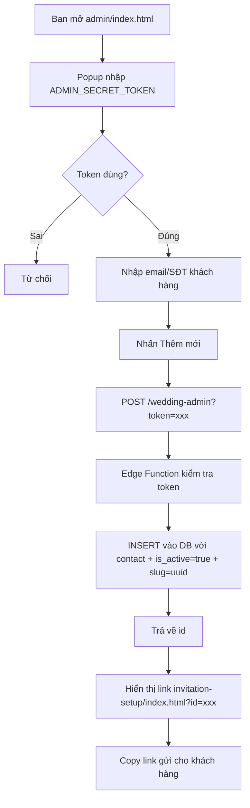
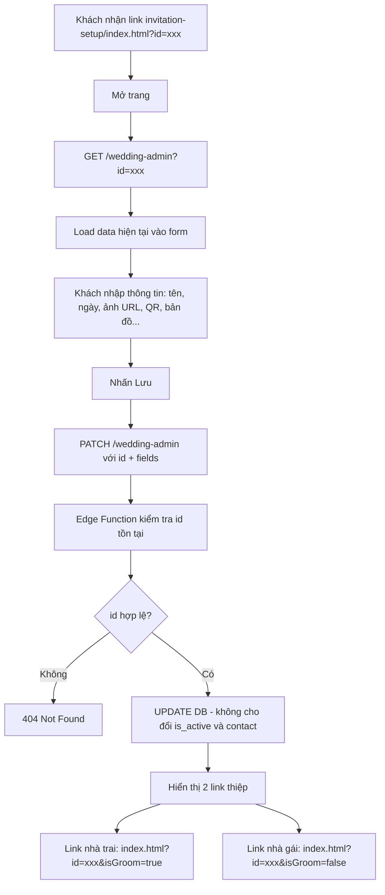

# Kiến Trúc Project - Web Thiệp Cưới Online

## Tổng Quan Hệ Thống

```
┌─────────────────────────────────────────────────────────────┐
│                      GITHUB PAGES (Free)                     │
│                                                              │
│   admin/index.html          invitation-setup/index.html   index.html  │
│   (Tạo thiệp)         (Khách nhập thông tin)    (Xem thiệp) │
└──────────┬───────────────────┬──────────────────────┬───────┘
           │                   │                      │
           │ POST+token        │ GET/PATCH+id          │ GET+id
           ▼                   ▼                      ▼
┌─────────────────────────────────────────────────────────────┐
│              SUPABASE EDGE FUNCTION (Free)                   │
│                   wedding-admin                              │
│                                                              │
│  POST  → Kiểm tra ADMIN_SECRET_TOKEN → INSERT               │
│  PATCH → Kiểm tra id tồn tại → UPDATE                       │
│  GET   → Public → SELECT                                     │
└──────────────────────────┬──────────────────────────────────┘
                           │ service_role_key
                           ▼
┌─────────────────────────────────────────────────────────────┐
│              SUPABASE POSTGRESQL (Free 500MB)                │
│                    Bảng: weddings                            │
│                                                              │
│  id, slug, is_active, contact                               │
│  groom_name, bride_name, story_quote, cover_image_url        │
│  gallery_images[]                                            │
│  ceremony_* (lễ thành hôn CHUNG: date, time, lunar)         │
│  groom_* (father, mother, address, image, google_sheet,     │
│           party, map, bank, qr)                              │
│  bride_* (father, mother, address, image, google_sheet,     │
│           party, map, bank, qr)                              │
└─────────────────────────────────────────────────────────────┘
```

---

## Sơ Đồ Luồng

### Luồng 1: Admin Tạo Thiệp Mới



### Luồng 2: Khách Hàng Nhập Thông Tin



### Luồng 3: Khách Mời Xem Thiệp

```mermaid
flowchart TD
    A[Khách mời nhận link domain.com/slug] --> B[GitHub Pages 404]
    B --> C[404.html redirect → router.html?slug=xxx]
    C --> D[GET /wedding-admin?slug=xxx]
    D --> E{Tìm thấy?}
    E -->|Không| F[Redirect về /]
    E -->|Có| G[Đọc field theme]
    G --> H[Redirect /public/themes/{theme}/?slug=xxx]
    H --> I{Có tham số name & relationship?}
    I -->|Có| J[Giải mã bằng AES key dqvinh]
    I -->|Không| K[Dùng tên mặc định]
    J --> L[Hiển thị lời chào cá nhân hóa]
    K --> L
    L --> M[Cover thiệp hiện ra]
    M --> N[Khách nhấn Mở Thiệp]
    N --> O[GET /wedding-admin?slug=xxx]
    O --> P{is_active?}
    P -->|false| Q[Hiện trang Thiệp hết hạn]
    P -->|true| R[Render toàn bộ nội dung thiệp]
    R --> S[Hiển thị thông tin theo isGroom=true/false]
    S --> T{Có google_sheet_url + link cá nhân?}
    T -->|Có| U[POST markViewed đến Google Apps Script]
    T -->|Không| V[Bỏ qua tracking]
```

### Luồng 4: Admin Tạo Link Cá Nhân Hóa (Tính năng mới)

```mermaid
flowchart TD
    A[Admin mở invitation-setup/index.html?id=xxx] --> B[Nhấn nút Tự động tạo link nhà trai/gái]
    B --> C[Lấy groom/bride_google_sheet_url]
    C --> D{URL hợp lệ?}
    D -->|Không| E[Hiển thị lỗi: Vui lòng cấu hình URL]
    D -->|Có| F[GET all guests từ Google Apps Script]
    F --> G[Với mỗi khách: Lấy tên hiển thị + quan hệ]
    G --> H[Mã hóa AES với key dqvinh]
    H --> I[Tạo link: domain/{slug}?isGroom=true/false&name=ENC&relationship=ENC]
    I --> J[Batch update vào Google Sheet cột D]
    J --> K[Hiển thị: Đã tạo link cho N khách mời]
```

---

## Cấu Trúc Thư Mục

```
WebCuoi/
├── index.html                          # Landing page (giới thiệu dịch vụ, chọn mẫu, thanh toán)
├── landing-script.js                   # Logic landing: render template cards, iframe preview, carousel
├── landing-styles.css                  # CSS riêng cho landing page
├── router.html                         # Router trung gian: đọc slug → xác định theme → redirect
├── 404.html                            # GitHub Pages SPA redirect → router.html
├── script.js                           # Logic JS thiệp: carousel, lightbox, calendar, RSVP...
├── style.css                           # Custom CSS (font, animation, shimmer...)
├── supabase.js                         # Fetch data từ Supabase & render vào thiệp (dùng slug)
├── admin/index.html                          # Trang tạo thiệp mới (chỉ bạn dùng)
├── invitation-setup/index.html             # Trang khách hàng nhập thông tin thiệp
├── manage-customer.js                  # Logic form quản lý: upload ảnh, bank select, auto-fill, lunar date
├── public/account/index.html                        # Trang tài khoản: đăng nhập OAuth, quản lý đơn hàng
├── account.js                          # Logic tài khoản: Supabase Auth, orders localStorage, profile
├── payment.js                          # Payment modal: inject HTML, xử lý thanh toán, lưu order
├── database-schema.sql                 # Schema database Supabase
├── README.md                           # Hướng dẫn sử dụng
├── documents/
│   ├── ARCHITECTURE.md                 # File này - kiến trúc hệ thống
│   ├── FLOW.md                         # Luồng chi tiết từng tính năng
│   ├── GOOGLE_APPS_SCRIPT_SETUP.md     # Hướng dẫn setup Google Apps Script
│   └── TAI_LIEU_TU_DONG_TAO_LINK.md    # Tài liệu tính năng tạo link cá nhân hóa
├── themes/
│   ├── basic-gold/index.html                  # Mẫu thiệp Classic Elegance
│   └── romantic-gold/index.html                  # Mẫu thiệp Modern Minimalist
├── assets/
│   ├── fonts/
│   │   ├── TheNautigal-Regular.ttf     # Font chữ viết tay tên cặp đôi
│   │   ├── katty-diona.woff2           # Font "Wedding Invitation" trên cover
│   │   └── Fz_Qellia_Fix.ttf           # Font bổ sung
│   ├── icons/
│   │   └── bin.png                     # Icon xóa ảnh
│   ├── images/                         # Ảnh mẫu, QR, icon...
│   └── musics/                         # Nhạc nền
└── supabase/
    └── functions/
        └── wedding-admin/
            └── index.ts                # Edge Function: tạo/đọc/cập nhật thiệp + xóa ảnh Storage
```

---

## Chi Tiết Các File

### `index.html`

Thiệp cưới chính. Gồm 6 block:

1. **Cover** — Ảnh nền + tên khách + nút mở thiệp
2. **Save The Date** — Ảnh cặp đôi + quote
3. **Thông tin gia đình** — Nhà trai + nhà gái (ảnh + tên bố mẹ + địa chỉ)
4. **Thư mời + Tiệc cưới** — Ngày giờ + lịch mini + xác nhận tham dự + gallery
5. **Hộp mừng cưới** — QR chuyển khoản
6. **Bản đồ** — Google Maps thumbnail + điều hướng

### `script.js`

- Carousel ảnh (3D effect, swipe, lightbox, pinch zoom)
- Mini calendar (tự tính âm lịch fallback)
- RSVP buttons (animation idle pulse + pop)
- Scroll reveal animations
- iOS viewport height fix
- Save QR (Web Share API)

### `supabase.js`

- Fetch data từ Edge Function theo `slug` trên URL params
- Render data vào các element có `id` tương ứng
- Load tên khách từ Google Apps Script (dùng slug)
- Tracking markViewed chỉ khi có link cá nhân hóa (name + relationship params)
- Hiện trang expired nếu `is_active = false`

### `admin/index.html`

- Nhập mã quản trị qua popup (lưu sessionStorage)
- POST tạo bản ghi mới → nhận id → hiển thị link manage
- Danh sách thiệp với search, pagination
- Toggle is_active, sửa slug, xóa thiệp + ảnh Storage

### `public/account/index.html` + `account.js`

- Đăng nhập OAuth (Facebook, Google) qua Supabase Auth
- Quản lý đơn hàng từ localStorage (tab "Đơn hàng")
- Sửa thông tin cá nhân (tab "Hồ sơ") → sync lên Supabase Auth
- Merge guestOrders vào orders\_{email} khi đăng nhập
- Order statuses: pending / completed / cancelled

### `payment.js`

- Inject modal HTML vào body (dùng chung cho index.html và public/account/index.html)
- Lưu order "pending" vào localStorage ngay khi mở modal
- Tạo UUID ở client làm manage_id, tạo slug từ tên + SĐT
- POST tạo wedding record → nhận slug thật từ response
- Update order pending → completed sau khi API thành công

### `manage-customer.js`

**Chức năng chính**:

- Quản lý form nhập liệu với validation
- Upload ảnh lên Supabase Storage (resize trước khi upload)
- Xóa ảnh khỏi Storage khi user xóa/thay thế
- Bank searchable select với 43 ngân hàng VN
- Auto-fill thông tin (ngày tiệc, giờ, địa chỉ)
- Tự động tính ngày âm lịch từ dương lịch
- Flatpickr date picker với locale tiếng Việt
- Skeleton loading khi trang load
- Pending uploads tracking (chỉ upload khi save)
- Gallery management (max 7 ảnh)

**Kiến trúc**:

```javascript
// Configuration
MANAGE_EDGE_URL, MANAGE_SUPABASE_URL, STORAGE_BASE_URL

// Image Management
pendingUploads = { singleImages: {}, galleryImages: [] }
deletedImages = { singleImages: [], galleryImages: [] }

// Functions
- uploadSingleImage() → filename
- uploadAllPendingImages() → {uploadedFilenames, errors}
- renderSingleImageUpload(), renderGalleryGrid()
- removeImage(), removeGalleryImage()

// Save Flow
saveAll() → upload images → update DB → update UI → clear pending
```

### `invitation-setup/index.html`

**Giao diện form quản lý**:

- Skeleton loader khi trang load
- Form đầy đủ tất cả trường trong DB
- Flatpickr date picker với locale tiếng Việt
- Bank searchable select dropdown
- Image upload với preview (cover, groom, bride, QR, gallery)
- Auto-fill hints và lunar date display
- 2 link thiệp (nhà trai/gái) với nút copy
- Toast notifications và loading overlay
- Responsive design với Tailwind CSS

**Sections**:

1. Header với nút Lưu
2. Link thiệp (nhà trai/gái)
3. Thông tin chung (tên, quote, cover, gallery)
4. Lễ thành hôn (ngày, giờ, âm lịch)
5. Nhà trai (bố mẹ, địa chỉ, ảnh, Google Sheet, map, tiệc, bank, QR)
6. Nhà gái (bố mẹ, địa chỉ, ảnh, Google Sheet, map, tiệc, bank, QR)

### `supabase/functions/wedding-admin/index.ts`

**Edge Function endpoints**:

- POST: public (không cần token), tạo bản ghi mới với id do client gửi lên
- PATCH: chỉ cần id, cập nhật thông tin + xóa ảnh cũ khỏi Storage
- GET: public, lấy thông tin theo `id` hoặc `slug`; `list=true` cần admin token
- DELETE: cần admin token, xóa thiệp + ảnh

**Xử lý Storage**:

- Nhận `deleted_images` array từ client
- Validate filename thuộc wedding hiện tại
- Xóa file khỏi Storage bucket `wedding-images`
- Trả về kết quả thành công/thất bại

---

## Bảo Mật

| Thao tác               | Ai được phép                       | Cơ chế                                    |
| ---------------------- | ---------------------------------- | ----------------------------------------- |
| Tạo thiệp (POST)       | Public (khách hàng sau thanh toán) | UUID client-generated làm id              |
| Cập nhật thiệp (PATCH) | Khách hàng có id                   | UUID v4 (122 bit entropy, khó đoán)       |
| Đọc thiệp (GET)        | Public                             | Không cần auth                            |
| Tắt thiệp / Xóa        | Chỉ admin                          | ADMIN_SECRET_TOKEN trong Supabase Secrets |
| Xem danh sách          | Chỉ admin                          | ADMIN_SECRET_TOKEN                        |

---

## Supabase Config

| Thông tin          | Giá trị                                    |
| ------------------ | ------------------------------------------ |
| Project URL        | `https://lcobawmkywtxhpezndsh.supabase.co` |
| Edge Function      | `/functions/v1/wedding-admin`              |
| Anon Key           | JWT token (dùng cho Authorization header)  |
| ADMIN_SECRET_TOKEN | Lưu trong Supabase Secrets                 |

---

## Công Nghệ & Chi Phí

| Thành phần     | Công nghệ                    | Giới hạn free  | Chi phí |
| -------------- | ---------------------------- | -------------- | ------- |
| Frontend       | HTML + Tailwind + Vanilla JS | Không giới hạn | $0      |
| Hosting        | GitHub Pages                 | Không giới hạn | $0      |
| Database       | Supabase PostgreSQL          | 500MB          | $0      |
| Storage        | Supabase Storage             | 1GB            | $0      |
| Backend        | Supabase Edge Functions      | 500k req/tháng | $0      |
| Guest Tracking | Google Apps Script           | Không giới hạn | $0      |
| Date Picker    | Flatpickr                    | Open source    | $0      |
| Encryption     | CryptoJS                     | Open source    | $0      |
| Fonts          | Google Fonts + Local         | Không giới hạn | $0      |
| **Tổng**       |                              |                | **$0**  |

## Thư Viện & Dependencies

| Thư viện     | Version | Mục đích                           | CDN                                                   |
| ------------ | ------- | ---------------------------------- | ----------------------------------------------------- |
| Tailwind CSS | 3.x     | Styling framework                  | `https://cdn.tailwindcss.com`                         |
| Supabase JS  | 2.x     | Database & Storage client          | `https://cdn.jsdelivr.net/npm/@supabase/supabase-js`  |
| Flatpickr    | 4.x     | Date picker với locale VI          | `https://cdn.jsdelivr.net/npm/flatpickr`              |
| CryptoJS     | 4.1.1   | AES encryption (tính năng planned) | `https://cdnjs.cloudflare.com/ajax/libs/crypto-js`    |
| Font Awesome | 6.4.0   | Icons                              | `https://cdnjs.cloudflare.com/ajax/libs/font-awesome` |
| Google Fonts | -       | Playfair, Great Vibes, Inter, etc. | `https://fonts.googleapis.com`                        |

---

## Tính Năng Đã Tích Hợp

### ✅ Google Sheets Integration

- Tích hợp Google Apps Script API để tracking khách mời
- Cấu trúc: Họ tên | Tên hiển thị | Quan hệ | Link thiệp | Đã xem | Xác nhận | Lời chúc | Thời gian
- Riêng biệt cho nhà trai (groom_google_sheet_url) và nhà gái (bride_google_sheet_url)
- API endpoints: getGuest, markViewed, confirm

### ✅ Supabase Storage Integration

- Upload ảnh trực tiếp lên Supabase Storage bucket `wedding-images`
- Database chỉ lưu filename (vd: `abc123.jpg`), không lưu full URL
- Frontend build URL: `STORAGE_BASE_URL + filename`
- Hỗ trợ: cover, groom/bride images, QR codes, gallery (max 7 ảnh)
- Auto-resize ảnh trước khi upload (max 1MB, 1920x1920px)
- Xóa ảnh cũ khỏi Storage khi user xóa/thay thế

### ✅ Auto-fill & Smart Defaults

- Ngày tiệc tự động = ngày lễ - 1 ngày (nếu trống)
- Giờ tiệc tự động = 17:00 (nếu trống)
- Địa chỉ tiệc tự động = địa chỉ nhà (nếu trống)
- Tự động tính ngày âm lịch từ dương lịch

### ✅ Bank Searchable Select

- Dropdown tìm kiếm 43 ngân hàng Việt Nam
- Filter theo tên, hỗ trợ keyboard navigation
- Tích hợp sẵn trong form nhà trai và nhà gái

### ✅ Skeleton Loading

- Hiển thị skeleton loader khi trang load
- Khớp với layout thực tế của form
- Shimmer animation effect

## Tính Năng Đã Triển Khai

### 🔄 Auto-Generate Personalized Guest Links (Spec đã hoàn thành)

**Trạng thái**: Đã hoàn thành và tích hợp vào invitation-setup/index.html

**Mô tả**: Tự động tạo link thiệp cá nhân hóa cho từng khách mời với mã hóa thông tin

**Tính năng chính**:

- 2 nút "Tự động tạo link" riêng biệt cho nhà trai và nhà gái
- Fetch danh sách khách từ Google Sheets
- Mã hóa tên + quan hệ bằng AES (key: "dqvinh")
- Tạo link: `domain/{slug}?isGroom=true/false&name=ENCRYPTED&relationship=ENCRYPTED`
- Batch update link vào Google Sheets (cột D)
- Bỏ qua khách đã có link hoặc chưa có quan hệ

**Công nghệ**:

- CryptoJS (AES encryption + Base64 encoding)
- Google Apps Script batch update endpoint
- URL-safe encrypted parameters

**Tài liệu**:

- Chi tiết: `documents/TAI_LIEU_TU_DONG_TAO_LINK.md`

## Mở Rộng Tương Lai

- [ ] Thêm nhạc nền động từ DB
- [ ] Dashboard thống kê lượt xem thiệp
- [ ] Gửi email/SMS thông báo cho khách mời
- [ ] Multi-language support (EN/VI)
- [ ] Template themes (cho phép chọn theme khác nhau)
