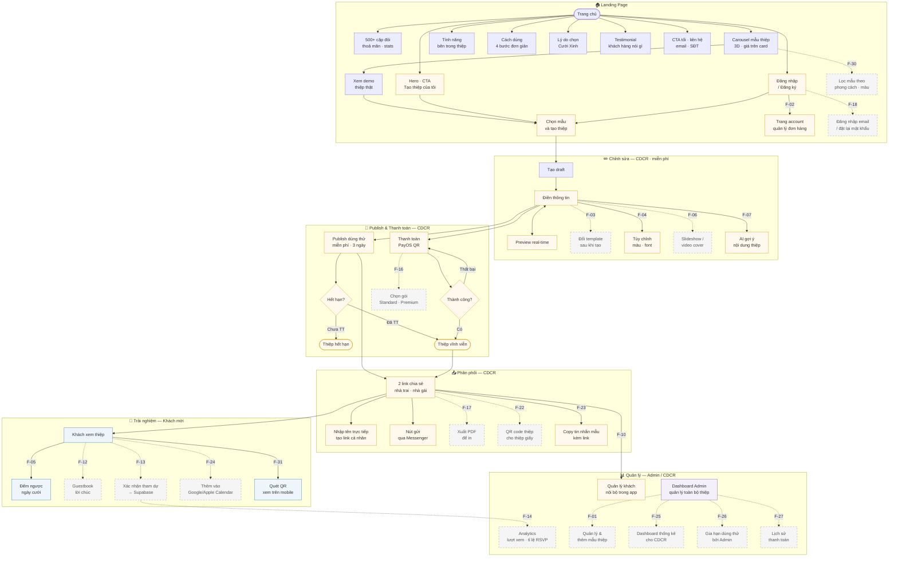
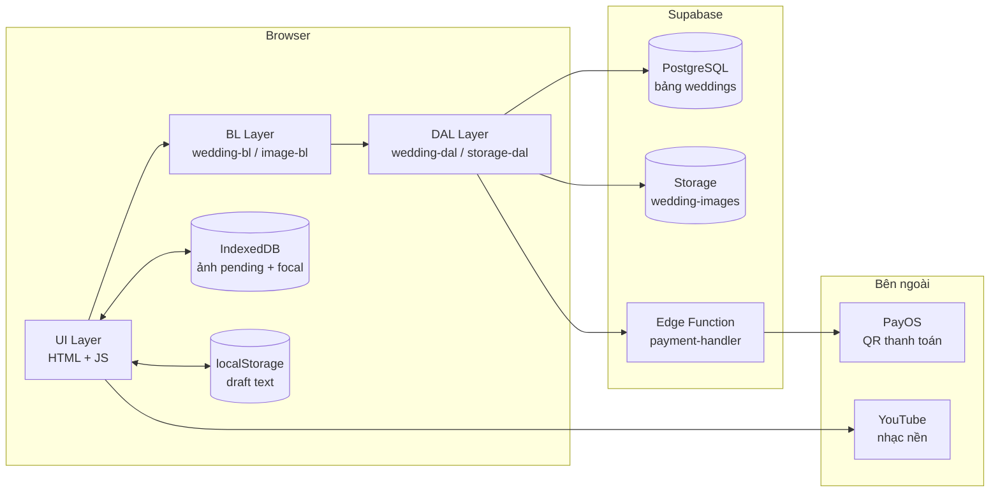

# CuoiXinh — Tổng quan hệ thống

## Mô tả

Nền tảng tạo thiệp cưới online cá nhân hóa. Người dùng chọn template, điền thông tin, thanh toán rồi nhận 2 link chia sẻ riêng (nhà trai / nhà gái) với tên khách mời được mã hóa.

---

## Sơ đồ luồng chính

> Node viền liền = tính năng hiện có · Node viền nét đứt = tính năng tương lai



> **Chú giải màu:** 🟡 Vàng = CDCR (cô dâu chú rể) · 🔵 Xanh dương = Khách mời · 🟣 Tím = Quản trị hệ thống · ⬜ Nét đứt = Tính năng tương lai

---

## Sơ đồ kiến trúc



---

## Luồng chính

```
Chọn template → Tạo draft → Điền thông tin → Preview
→ Publish dùng thử (miễn phí, public 3 ngày) → Chia sẻ link → Khách RSVP
                                ↓ hết hạn
                   Thanh toán (PayOS QR) → Thiệp vĩnh viễn
```

---

## Tính năng hiện có

### Landing Page

| Mục          | Nội dung                                                  |
| ------------ | --------------------------------------------------------- |
| Hero & CTA        | Headline, nút "Tạo thiệp của tôi", trust badges                   |
| Stats             | 500+ cặp đôi, 10+ mẫu, 5★ đánh giá — hardcoded trong hero        |
| Carousel mẫu thiệp | 3D carousel, giá hiển thị trên từng card, xem demo thiệp thật   |
| Tính năng         | Section giới thiệu nội dung bên trong thiệp + phone mockup        |
| Cách dùng         | 4 bước đơn giản                                                   |
| Lý do chọn        | Benefits grid "Tại sao chọn Cưới Xinh?"                           |
| Testimonial       | Section "Khách hàng nói gì?" với testimonial cards                |
| CTA cuối          | Section tối, nút tạo thiệp, email + SĐT liên hệ                  |
| Đăng nhập         | Xác thực qua Supabase (magic link)                                |

### Chỉnh sửa thiệp (`invitation-setup`)

| Section             | Nội dung                                        |
| ------------------- | ----------------------------------------------- |
| Thông tin cặp đôi   | Tên, ảnh cặp đôi, ảnh cover, slogan             |
| Gia đình            | Tên bố mẹ, địa chỉ, ảnh riêng nhà trai/gái      |
| Lễ thành hôn        | Ngày giờ dương/âm, địa điểm, bản đồ             |
| Lễ vu quy           | Tùy chọn bật/tắt, giờ, địa điểm                 |
| Tiệc cưới           | Ngày giờ dương/âm, địa điểm, bản đồ (cả 2 nhà)  |
| Gallery ảnh         | Tối đa 7 ảnh, focal point per ảnh               |
| Timeline            | Lịch trình sự kiện theo loại (ceremony / party) |
| Câu chuyện tình yêu | Tối đa 10 mốc, mỗi mốc có ảnh + focal point     |
| Ngân hàng           | Số tài khoản, tên chủ, ảnh QR (cả 2 bên)        |
| Nhạc nền            | Link YouTube, bật/tắt                           |
| RSVP                | Bật/tắt, tin nhắn tùy chỉnh                     |
| Hiển thị section    | Toggle từng section độc lập                     |
| Footer              | Text chân trang                                 |

### Tùy chỉnh giao diện (F-04)

Màn "Giao diện" trong editor: đổi **phông chữ** (heading/body), **bảng màu** chủ đạo (heading, body, accent, background — chọn qua Coloris) ngay trong cùng template. Lưu vào `theme_setting`; mặc định rơi về preset gốc của từng theme.

### AI gợi ý nội dung (F-07)

Modal AI trong editor: nhập từ khóa → sinh nội dung thiệp (slogan, **câu chuyện tình yêu**, timeline…). Edge Function `ai-invitation` (Gemini key rotation + Groq fallback), có bảng `ai_usage` giới hạn lượt dùng.

### Focal Point

Tất cả ảnh (cover, groom, bride, gallery, love story) đều hỗ trợ chọn điểm lấy nét. Được lưu vào IDB để tồn tại qua F5 trước khi save.

### Template & Theme

- 3 template: `basic-gold`, `romantic-gold`, `vintage-forest`
- Mỗi template là một trang độc lập render từ dữ liệu JSON chung

### Lưu trữ

- **Supabase PostgreSQL** — dữ liệu chính
- **Supabase Storage** — ảnh đã upload
- **IndexedDB** — ảnh pending (chưa upload) + focal points
- **localStorage** — draft text (auto-save mỗi 1.5s)

### Thanh toán

- Tích hợp PayOS, tạo QR động
- Poll trạng thái mỗi 30s, timeout 5 phút
- Sau thanh toán: set `is_published = true`, hiển thị 2 link chia sẻ

### Chia sẻ & Khách mời

- 2 link cá nhân hóa: nhà trai / nhà gái
- Tên & quan hệ khách mã hóa AES trong URL
- Quản lý khách mời nội bộ trong app (lưu tại Supabase, không dùng Google Sheet)
- Tạo link nhanh trực tiếp: nhập tên + quan hệ → link cá nhân hóa ngay
- Nút chia sẻ qua Messenger (mobile: mở app, desktop: copy + hướng dẫn dán)
- **Câu mẫu chia sẻ (F-23):** 10 câu mời mẫu có sẵn, biến trộn `##Danh xưng##` / `##link##`, nút "Chèn mẫu" / "Đổi mẫu khác", copy để dán vào Zalo/FB

### Trải nghiệm khách mời

- **Đếm ngược ngày cưới (F-05):** widget countdown hiển thị trên thiệp
- Xác nhận tham dự (RSVP): nút Tham dự / Không tham dự hiển thị lời cảm ơn — *hiện chỉ phản hồi tại chỗ, chưa lưu Supabase (xem F-13)*
- **Quét QR xem trên mobile (F-31):** khi xem thiệp trên desktop (≥1024px), card nổi (góc dưới phải) hiện sẵn mã QR mã hoá link hiện tại (giữ nguyên tên khách đã cá nhân hoá nếu có) — không cần bấm gì, quét là mở luôn trên điện thoại. Có nút thu gọn về icon tròn nhỏ + nút sao chép liên kết dự phòng. Tự ẩn trong preview của editor. Thư viện `qrcodejs` nạp động qua CDN khi cần, không tải sẵn cho khách xem trên mobile.

### Quản lý đơn hàng cho khách (F-02)

- Trang account: gộp đơn ở localStorage (`orders_<email>` / `guestOrders`) với thiệp của user từ DB (`weddings.user_id`, edge `my-weddings`)
- Trạng thái đơn: draft / completed / pending / cancelled

### Admin

- Dashboard quản lý toàn bộ thiệp
- Tìm kiếm, pagination, edit slug, toggle active, xóa

---

## Tính năng tương lai (Roadmap)

### P0 — Nền tảng (cần thiết để scale)

| #    | Tính năng                      | Mô tả                                                                          |
| ---- | ------------------------------ | ------------------------------------------------------------------------------ |
| F-01 | **Thêm template**              | Mở rộng lên 5–10 template, đa dạng phong cách (hiện đại, tối giản, màu pastel) |
| F-03 | **Đổi template sau khi tạo**   | Cho phép chuyển theme mà không mất dữ liệu                                     |

### P1 — Trải nghiệm người dùng

| #    | Tính năng                            | Mô tả                                                           |
| ---- | ------------------------------------ | --------------------------------------------------------------- |
| F-06 | **Slideshow / video cover**          | Thay ảnh bìa bằng slideshow nhiều ảnh hoặc video ngắn           |
| F-08 | **Ảnh bìa + overlay text tùy chỉnh** | Thêm text / sticker lên ảnh bìa trong editor                    |
| F-30 | **Lọc mẫu thiệp**                    | Lọc / tìm kiếm mẫu theo phong cách, màu sắc (khi có nhiều mẫu)  |

### P2 — Khách mời & Tương tác

| #    | Tính năng                     | Mô tả                                                                |
| ---- | ----------------------------- | -------------------------------------------------------------------- |
| F-12 | **Guestbook (Sổ lưu bút)**     | Khách gửi lời chúc, cặp đôi duyệt và hiển thị trên thiệp              |
| F-13 | **Xác nhận tham dự (RSVP)**    | Lưu trạng thái tham dự / từ chối của khách vào Supabase (nút đã có, chưa lưu DB) |
| F-14 | **Analytics cơ bản**           | Số lượt xem, số khách RSVP, tỉ lệ tham dự per event                   |
| F-22 | **QR code thiệp**              | Tạo QR code để in lên thiệp giấy, khách quét để mở thiệp online       |
| F-24 | **Thêm vào Calendar**          | Nút thêm ngày cưới vào Google Calendar / Apple Calendar cho khách      |
| F-25 | **Dashboard thống kê cho CDCR**| Trang xem ai đã xem thiệp, ai chưa, tỉ lệ RSVP — không cần vào Sheet |

### P3 — Mở rộng nghiệp vụ

| #    | Tính năng                              | Mô tả                                                                           |
| ---- | -------------------------------------- | ------------------------------------------------------------------------------- |
| F-16 | **Gói dịch vụ (pricing tiers)**        | Free (draft xem trước) / Standard / Premium (thêm template, tính năng nâng cao) |
| F-17 | **Thiệp có thể in**                    | Xuất thiệp ra PDF chuẩn in A5/A6                                                |
| F-18 | **Đặt lại mật khẩu / đăng nhập email** | Bổ sung Auth đầy đủ thay vì chỉ dùng Supabase magic link                        |
| F-19 | **White-label / agency mode**          | Cho phép công ty tổ chức tiệc cưới tạo thiệp cho nhiều khách hàng               |
| F-26 | **Gia hạn dùng thử**                   | Admin gia hạn thêm ngày cho thiệp sắp hết hạn chưa thanh toán                   |
| F-27 | **Lịch sử thanh toán**                 | Log giao dịch PayOS để tra cứu khi có tranh chấp                                |
| F-20 | **API public**                         | API để tích hợp với phần mềm quản lý tiệc cưới bên thứ ba                       |
